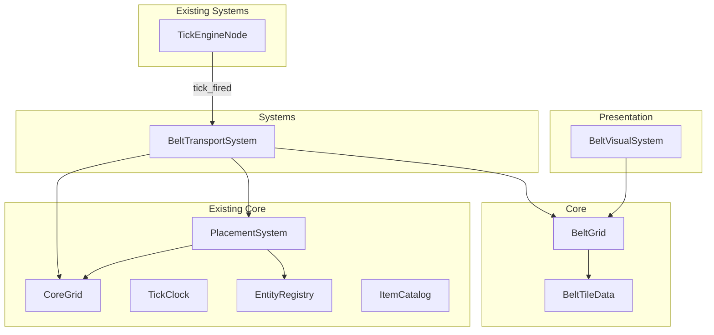
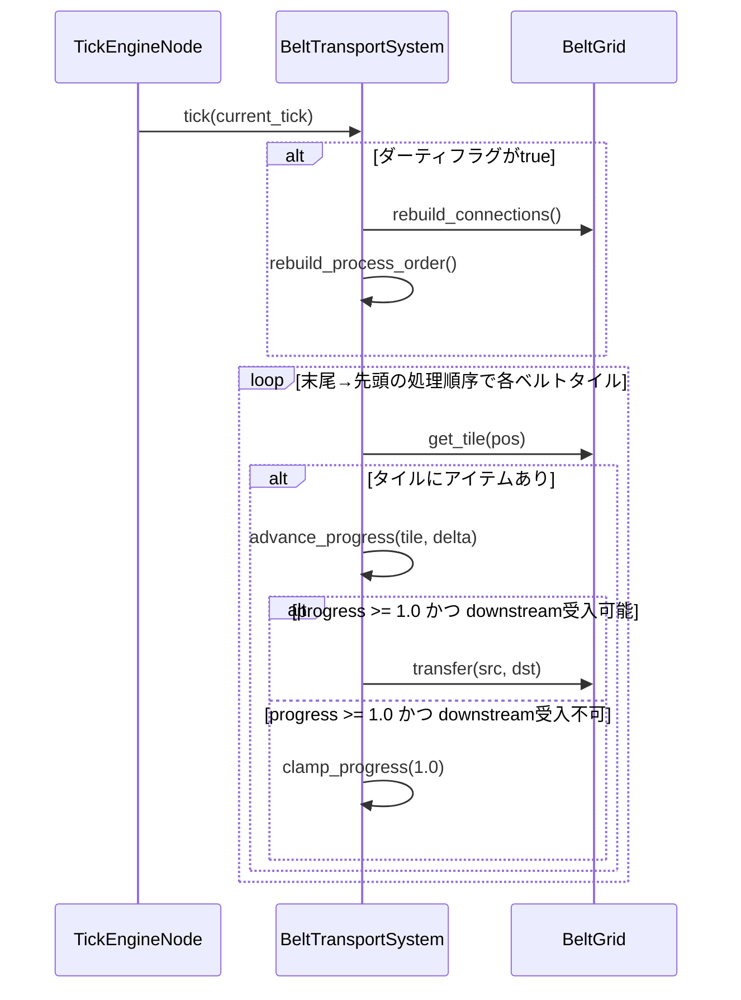
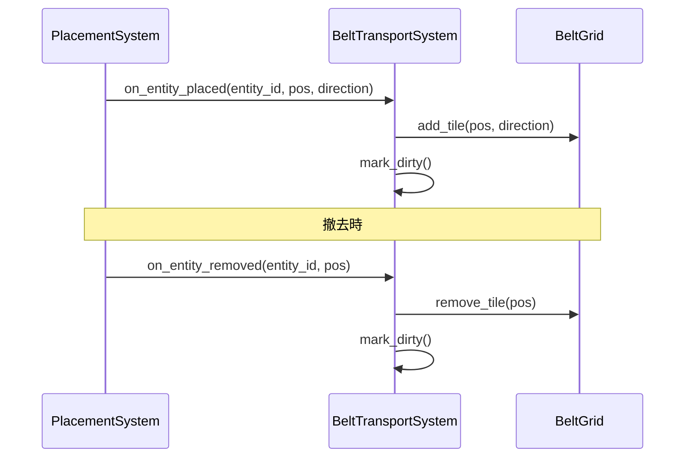
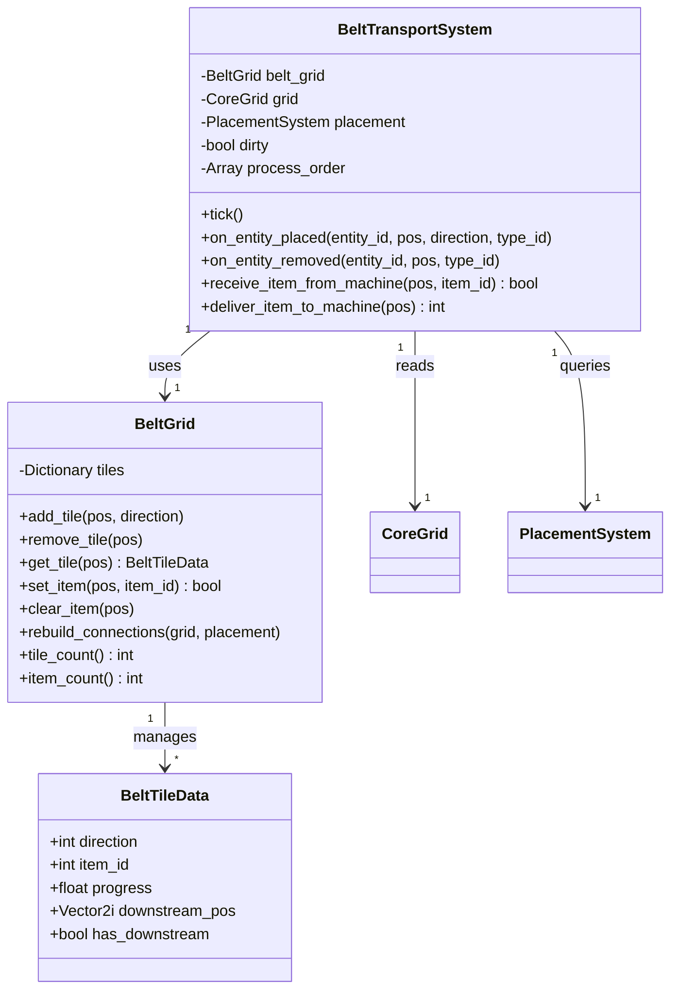

# Design Document: Conveyor Belt

## Overview

**Purpose**: ベルトコンベアシステムは、機械間のアイテム自動輸送を実現する。プレイヤーが配置した1x1方向付きベルトタイル上をアイテムが一定速度で進行し、隣接ベルトや機械ポートへ自動転送される。バックプレッシャーによりアイテムの消失・重複を防ぎ、FIFO順序を保証する。

**Users**: ファクトリービルダーのプレイヤーが、採掘→加工→納品のコアループにおける自動輸送ラインの構築に使用する。

**Impact**: 既存のCoreGrid/PlacementSystem/TickClock基盤の上に、ベルトシミュレーション専用のデータ層とシステム層を新規導入する。

### Goals
- ベルトタイル上でのアイテム搬送（1タイル/秒、1タイル=最大1アイテム）を実現する
- 隣接ベルト間および機械ポートとの自動転送を実現する
- バックプレッシャーの連鎖的伝播と自動解除を実現する
- FIFO順序とアイテム保存則を保証する
- ベルト500本+アイテム2000個で16ms/tick以下のパフォーマンスを達成する

### Non-Goals
- ベルトの速度段階（ティア区分）
- ベルト上のアイテムフィルタリング
- アンダーグラウンドベルト（地下ベルト）
- スプリッター/マージャー
- 撤去時のアイテムドロップ/インベントリ返却
- 機械ポートI/Oの詳細な接続解決ロジック（別機能として定義）

## Architecture

### Existing Architecture Analysis

既存システムが以下の基盤を提供する:

- **CoreGrid**（RefCounted）: 64x64グリッドの占有管理。`occupy_rect`/`vacate_rect`による原子的操作
- **PlacementSystem**（RefCounted）: エンティティの配置/撤去。`place()`/`remove()`メソッド。Belt(ID=3, footprint=1x1)は登録済み
- **TickClock**（RefCounted）: 60tps固定のティック発火。`advance(delta_usec) -> int`
- **TickEngineNode**（Node）: Godotフレームループとティックのブリッジ。`tick_fired`シグナル
- **EntityRegistry**: エンティティ定義カタログ。Belt(ID=3)登録済み
- **ItemCatalog**: アイテム定義カタログ。アイテム種別IDでアイテムを識別
- **Enums.Direction**: N=0, E=1, S=2, W=3の4方向enum

これらは変更せず、新規コンポーネントが既存APIを利用する。

### Architecture Pattern & Boundary Map



**Architecture Integration**:
- **Selected pattern**: データ指向ティックシステム — 既存のCoreGrid/PlacementSystemパターンに準拠。コアデータ（RefCounted）とシステム（RefCounted）を分離し、Nodeは薄いアダプター
- **Domain boundaries**: BeltGrid/BeltTileDataがベルト固有のデータを所有。BeltTransportSystemがティック処理ロジックを所有。CoreGrid/PlacementSystemの責務には侵入しない
- **Existing patterns preserved**: RefCountedベースの純粋ロジック、Dictionary<Vector2i, Data>パターン（_occupancyと同様）、ダーティフラグによる遅延再構築
- **New components rationale**: BeltGrid（ベルト固有データの独立管理）、BeltTileData（タイルごとの状態保持）、BeltTransportSystem（ティック処理の分離）
- **Steering compliance**: コアロジックはSceneTree非依存、静的型付け、テスト可能

### Technology Stack

| Layer | Choice / Version | Role in Feature | Notes |
|-------|------------------|-----------------|-------|
| Simulation / Core Logic | GDScript + RefCounted | BeltGrid, BeltTileData, BeltTransportSystem | SceneTree非依存 |
| Presentation | GDScript + Node2D | BeltVisualSystem | コア状態の視覚化 |
| Data | Dictionary + PackedInt32Array | ベルト状態、処理順序キャッシュ | 既存パターン準拠 |
| Events | Godot Signal | tick_fired, entity_placed/removed | プレゼンテーション通知用 |
| Infrastructure | Godot 4.3+ / GdUnit4 | 実行環境 / テスト | xvfb-run CLIテスト |

## System Flows

### ティック処理フロー



### 配置/撤去時のベルト接続更新フロー



## Requirements Traceability

| Requirement | Summary | Components | Interfaces | Flows |
|-------------|---------|------------|------------|-------|
| 1.1 | アイテム搬送速度 1タイル/秒 | BeltTransportSystem, BeltTileData | BeltTransportSystem.tick() | ティック処理フロー |
| 1.2 | 1タイル最大1アイテム | BeltTileData, BeltGrid | BeltGrid.add_item() | - |
| 1.3 | 向き方向への搬送 | BeltTransportSystem | BeltTransportSystem.tick() | ティック処理フロー |
| 1.4 | 4方向サポート | BeltTileData | BeltGrid.add_tile() | - |
| 2.1 | 隣接ベルトへの転送 | BeltTransportSystem, BeltGrid | BeltGrid.transfer() | ティック処理フロー |
| 2.2 | 転送先なしで待機 | BeltTransportSystem | BeltTransportSystem.tick() | ティック処理フロー |
| 2.3 | 転送先満杯で待機 | BeltTransportSystem | BeltTransportSystem.tick() | ティック処理フロー |
| 2.4 | 不正方向への転送拒否 | BeltGrid | BeltGrid.rebuild_connections() | 接続更新フロー |
| 2.5 | 直線5本チェーン輸送 | BeltTransportSystem | BeltTransportSystem.tick() | ティック処理フロー |
| 2.6 | L字/U字輸送 | BeltTransportSystem, BeltGrid | BeltGrid.rebuild_connections() | ティック処理フロー |
| 3.1 | 出力先満杯で停止 | BeltTransportSystem | BeltTransportSystem.tick() | ティック処理フロー |
| 3.2 | バックプレッシャー連鎖 | BeltTransportSystem | BeltTransportSystem.tick() | ティック処理フロー |
| 3.3 | 空き発生で再開 | BeltTransportSystem | BeltTransportSystem.tick() | ティック処理フロー |
| 3.4 | バックプレッシャー中のアイテム保存 | BeltTransportSystem, BeltGrid | BeltTransportSystem.tick() | ティック処理フロー |
| 4.1 | 機械出力→ベルト転送 | BeltTransportSystem | BeltTransportSystem.tick() | ティック処理フロー |
| 4.2 | ベルト→機械入力転送 | BeltTransportSystem | BeltTransportSystem.tick() | ティック処理フロー |
| 4.3 | 機械入力満杯でバックプレッシャー | BeltTransportSystem | BeltTransportSystem.tick() | ティック処理フロー |
| 4.4 | ベルト満杯で機械出力転送拒否 | BeltTransportSystem | BeltTransportSystem.tick() | ティック処理フロー |
| 5.1 | 配置時の接続更新 | BeltTransportSystem, BeltGrid | on_entity_placed() | 接続更新フロー |
| 5.2 | 撤去時の接続更新 | BeltTransportSystem, BeltGrid | on_entity_removed() | 接続更新フロー |
| 5.3 | 未変更時の接続維持 | BeltTransportSystem | BeltTransportSystem.tick() | - |
| 5.4 | 撤去時のアイテム消失 | BeltGrid | BeltGrid.remove_tile() | 接続更新フロー |
| 6.1 | FIFO出力 | BeltTransportSystem | BeltTransportSystem.tick() | ティック処理フロー |
| 6.2 | 飛び越え防止 | BeltTransportSystem | BeltTransportSystem.tick() | ティック処理フロー |
| 6.3 | 先行アイテム優先出力 | BeltTransportSystem | BeltTransportSystem.tick() | ティック処理フロー |
| 7.1 | アイテム総数保存 | BeltTransportSystem, BeltGrid | BeltTransportSystem.tick() | ティック処理フロー |
| 7.2 | 転送時の正確な増減 | BeltGrid | BeltGrid.transfer() | ティック処理フロー |
| 7.3 | 重複生成の禁止 | BeltTransportSystem, BeltGrid | BeltTransportSystem.tick() | ティック処理フロー |
| 8.1 | 500本2000個で16ms/tick | BeltTransportSystem | BeltTransportSystem.tick() | ティック処理フロー |
| 8.2 | 64x64グリッド対応 | BeltGrid, CoreGrid | - | - |
| 9.1 | アイテムの視覚移動表示 | BeltVisualSystem | BeltVisualSystem.update_visuals() | - |
| 9.2 | 停止状態の視覚表現 | BeltVisualSystem | BeltVisualSystem.update_visuals() | - |

## Components and Interfaces

| Component | Domain/Layer | Intent | Req Coverage | Key Dependencies | Contracts |
|-----------|--------------|--------|--------------|-----------------|-----------|
| BeltTileData | Core | ベルトタイル1つの状態（方向、アイテム、進行度）を保持する値オブジェクト | 1.1-1.4, 2.1-2.4 | なし | State |
| BeltGrid | Core | 全ベルトタイルのデータストアと接続グラフを管理 | 1.2, 2.1-2.6, 5.1-5.4, 7.1-7.3, 8.2 | BeltTileData (P0) | Service, State |
| BeltTransportSystem | Systems | ティックごとのアイテム搬送ロジック（進行、転送、バックプレッシャー） | 1.1-1.4, 2.1-2.6, 3.1-3.4, 4.1-4.4, 6.1-6.3, 7.1-7.3, 8.1 | BeltGrid (P0), CoreGrid (P0), PlacementSystem (P1) | Service |
| BeltVisualSystem | Presentation | ベルト上アイテムの視覚表現（進行アニメーション、停止表示） | 9.1, 9.2 | BeltGrid (P0) | State |

### Core

#### BeltTileData

| Field | Detail |
|-------|--------|
| Intent | ベルトタイル1つの状態（方向、保持アイテム、進行度）を保持する不変値オブジェクト |
| Requirements | 1.1, 1.2, 1.3, 1.4 |

**Responsibilities & Constraints**
- ベルトタイルの方向（Enums.Direction）、保持アイテムのアイテム種別ID（0=なし）、進行度（0.0〜1.0）を保持
- 1タイルあたり最大1個のアイテム（item_id == 0 で空、item_id > 0 でアイテム保持中）
- RefCountedベース、SceneTree非依存

**Dependencies**
- なし（純粋な値オブジェクト）

**Contracts**: State [x]

##### State Management
- State model:
  - `direction: int` — Enums.Direction (N=0, E=1, S=2, W=3)
  - `item_id: int` — 保持中のアイテム種別ID（0=空）
  - `progress: float` — アイテムの進行度（0.0=タイル入口、1.0=タイル出口）
  - `downstream_pos: Vector2i` — 下流ベルトの座標（接続なしの場合は無効値）
  - `has_downstream: bool` — 下流接続の有無
- Persistence: ランタイム状態のみ。セーブ/ロードは将来対応
- Concurrency: シングルスレッド（ティック同期処理）

#### BeltGrid

| Field | Detail |
|-------|--------|
| Intent | 全ベルトタイルのデータストアと接続グラフを一元管理する |
| Requirements | 1.2, 2.1-2.6, 5.1-5.4, 7.1-7.3, 8.2 |

**Responsibilities & Constraints**
- Dictionary<Vector2i, BeltTileData>によるベルトタイル管理
- ベルト間の接続関係（downstream）の計算と保持
- タイルの追加/削除とアイテム操作の原子的実行
- アイテム保存則の維持（追加/削除は1対1）

**Dependencies**
- Inbound: BeltTileData — タイル状態の保持 (P0)
- Outbound: CoreGrid — 隣接セルのベルト判定に使用 (P0)

**Contracts**: Service [x] / State [x]

##### Service Interface
```gdscript
class_name BeltGrid
extends RefCounted

## ベルトタイルを追加する
## Preconditions: posがグリッド範囲内
## Postconditions: BeltTileDataが作成され登録される
func add_tile(pos: Vector2i, direction: int) -> void

## ベルトタイルを削除する（保持アイテムは消失）
## Postconditions: BeltTileDataが削除される。保持アイテムは消失する
func remove_tile(pos: Vector2i) -> void

## 指定座標のBeltTileDataを取得する
## Postconditions: ベルトが存在すればBeltTileData、なければnull
func get_tile(pos: Vector2i) -> BeltTileData

## 指定座標がベルトタイルか判定する
func has_tile(pos: Vector2i) -> bool

## ベルトタイルにアイテムを設定する（空のタイルのみ）
## Preconditions: posにベルトが存在し、アイテムを保持していない
## Postconditions: 成功時true、タイルのitem_idとprogressが設定される
func set_item(pos: Vector2i, item_id: int) -> bool

## ベルトタイルからアイテムを除去する
## Postconditions: タイルのitem_id=0, progress=0.0にリセット
func clear_item(pos: Vector2i) -> void

## 全ベルトタイルの接続関係を再計算する
## Postconditions: 各タイルのdownstream_pos/has_downstreamが更新される
func rebuild_connections(grid: CoreGrid, placement: PlacementSystem) -> void

## 登録されたベルトタイル数を返す
func tile_count() -> int

## アイテムを保持中のベルトタイル数を返す
func item_count() -> int

## 全ベルト座標を取得する
func get_all_positions() -> Array[Vector2i]
```
- Preconditions: add_tile/remove_tileはPlacementSystemの配置/撤去と連動して呼び出される
- Postconditions: アイテム操作後もアイテム総数の保存則が維持される
- Invariants: 任意の時点でitem_count() + 外部に転送済みアイテム数 = 投入アイテム総数

##### State Management
- State model: `_tiles: Dictionary` — Vector2i → BeltTileData
- Persistence: ランタイムのみ
- Concurrency: シングルスレッド

**Implementation Notes**
- Integration: PlacementSystemの配置/撤去時にadd_tile/remove_tileを呼び出す。接続再計算はダーティフラグで遅延実行
- Validation: add_tile時にグリッド範囲チェック。set_item時に空きチェック
- Risks: CoreGridとBeltGridの整合性 — PlacementSystem経由でのみ操作することで保証

#### BeltTransportSystem

| Field | Detail |
|-------|--------|
| Intent | ティックごとのベルト上アイテム搬送ロジック（進行、転送、バックプレッシャー）を実行する |
| Requirements | 1.1-1.4, 2.1-2.6, 3.1-3.4, 4.1-4.4, 6.1-6.3, 7.1-7.3, 8.1 |

**Responsibilities & Constraints**
- ティックごとにすべてのベルト上アイテムの進行度を更新
- 末尾→先頭の処理順序でFIFOと飛び越え防止を保証
- バックプレッシャーの連鎖的伝播と自動解除
- 機械ポートからのアイテム受入と機械ポートへのアイテム引き渡し
- 配置/撤去時の接続グラフ再構築（ダーティフラグ方式）

**Dependencies**
- Inbound: TickEngineNode — tick_firedシグナルでティック受信 (P0)
- Outbound: BeltGrid — ベルトデータの読み書き (P0)
- Outbound: CoreGrid — 隣接セル情報の取得 (P0)
- Outbound: PlacementSystem — エンティティ情報の取得 (P1)

**Contracts**: Service [x]

##### Service Interface
```gdscript
class_name BeltTransportSystem
extends RefCounted

## 1ティック分のベルト搬送処理を実行する
## Preconditions: belt_gridが初期化済み
## Postconditions:
##   - ダーティフラグがtrueの場合、接続とプロセス順序を再構築してからフラグをリセット
##   - 全アイテムの進行度がSPEED_PER_TICK分だけ加算される（ブロックされていない場合）
##   - progress >= 1.0のアイテムは下流に転送される（下流が受入可能な場合）
##   - アイテム保存則が維持される
func tick() -> void

## エンティティ配置通知を受け取り、ベルトタイルを追加してダーティフラグを設定する
## Preconditions: entity_type_idがBelt(ID=3)であること
func on_entity_placed(entity_id: int, pos: Vector2i, direction: int, entity_type_id: int) -> void

## エンティティ撤去通知を受け取り、ベルトタイルを削除してダーティフラグを設定する
func on_entity_removed(entity_id: int, pos: Vector2i, entity_type_id: int) -> void

## 機械出力ポートからベルトへのアイテム受入
## Preconditions: posにベルトが存在する
## Postconditions: 成功時true（ベルトが空の場合のみ）、失敗時false
func receive_item_from_machine(pos: Vector2i, item_id: int) -> bool

## ベルト末端から機械入力ポートへのアイテム引き渡し
## Preconditions: posにベルトが存在する
## Postconditions: 成功時はアイテムIDを返しベルトをクリア、失敗時は0を返す
## 条件: アイテムが存在し、かつprogress >= 1.0（末端到達済み）の場合のみ引き渡す
func deliver_item_to_machine(pos: Vector2i) -> int
```
- Preconditions: BeltGrid, CoreGrid, PlacementSystemが初期化済み
- Postconditions: tick()呼び出し後、アイテム保存則が維持される
- Invariants: 処理順序は常に末尾→先頭（下流→上流）

**Implementation Notes**
- Integration: TickEngineNodeのtick_firedシグナルに接続。PlacementSystemの配置/撤去後にon_entity_placed/on_entity_removedを呼び出す
- Validation: ベルト以外のエンティティ（entity_type_id != 3）の配置/撤去通知は無視
- Risks: 処理順序キャッシュの再構築コスト — ベルト数500本程度では十分高速。深さベースソートで O(N) で再計算可能

### Presentation

#### BeltVisualSystem

| Field | Detail |
|-------|--------|
| Intent | BeltGridの状態を読み取り、ベルト上アイテムの視覚表現を更新する |
| Requirements | 9.1, 9.2 |

**Responsibilities & Constraints**
- BeltGridのアイテム位置と進行度に基づいて視覚表現を更新
- `_process(delta)`で毎フレーム呼び出し（ティック間のアニメーション補間）
- ベルト上アイテムは個別ノード化せず、Node2D._draw()で毎フレーム2パス描画（Pass1: ベルト背景・矢印、Pass2: アイテム円）。Godotのレンダリングバッチ処理に委譲。大規模ベルト（500+）でFPS低下時はMultiMeshInstance2Dへの最適化を検討

**Dependencies**
- Inbound: BeltGrid — ベルト状態の読み取り (P0)

**Contracts**: State [x]

##### State Management
- State model: BeltGridの状態を観察し、_process()でqueue_redraw()を呼び出して毎フレーム_draw()で再描画
- Persistence: なし（フレームごとに再計算）
- Concurrency: メインスレッド（_process内）

**Implementation Notes**
- Integration: Node2Dとして実装し、BeltGridへの参照を保持。_process()でqueue_redraw()、_draw()で2パス描画（ベルトタイル→アイテム）
- Rendering: _draw()によるcanvasコマンド描画。draw_rect()でベルト背景・境界線、draw_colored_polygon()で方向矢印、draw_circle()/draw_arc()でアイテム描画。バックプレッシャー時はアイテム色をREDに変更
- Risks: 大量ベルト時の描画コスト — 現在の_draw()実装は<100ベルトで十分。500+ベルトでFPS低下時はMultiMeshInstance2Dへの最適化を検討

## Data Models

### Domain Model



### Logical Data Model

**BeltTileData（値オブジェクト）**:
- `direction: int` — 搬送方向（Enums.Direction）。配置時に確定、不変
- `item_id: int` — アイテム種別ID。0=空、正整数=アイテム保持中
- `progress: float` — アイテムの進行度。0.0（タイル入口）〜1.0（タイル出口）
- `downstream_pos: Vector2i` — 下流ベルトの座標。rebuild_connectionsで計算
- `has_downstream: bool` — 下流接続の有無。rebuild_connectionsで計算

**BeltGrid（データストア）**:
- `_tiles: Dictionary` — Key: Vector2i（セル座標）、Value: BeltTileData
- アイテムの一意性: 各タイルに最大1個。item_id > 0 のタイル数 = item_count()

**BeltTransportSystem（プロセスキャッシュ）**:
- `_process_order: Array[Vector2i]` — ティック処理順序（末尾→先頭）。ダーティ時に再構築
- `_dirty: bool` — 接続グラフの再構築フラグ

**Consistency & Integrity**:
- トランザクション境界: tick()の1回の呼び出しが1トランザクション。途中で状態が不整合になる中間状態は外部に公開されない
- アイテム保存則: set_item/clear_itemは常にペアで使用。transfer操作は「clear_item(src) + set_item(dst)」の原子的実行
- 方向の参照整合性: BeltTileDataのdirectionはEnums.Direction (0-3) の範囲内

## Error Handling

### Error Strategy
ベルトシステムはシミュレーション内部で動作するため、エラーは静かにフォールバックする（ユーザー向けエラーメッセージは不要）。

### Error Categories and Responses
- **範囲外座標**: グリッド範囲外への操作は無視（CoreGrid.is_in_boundsで検証）
- **存在しないタイルへのアイテム設定**: set_itemがfalseを返す
- **満杯タイルへのアイテム設定**: set_itemがfalseを返し、バックプレッシャーとして処理
- **接続グラフの不整合**: rebuild_connectionsでフルリビルドにより自己修復

## Testing Strategy

### Layer 1: Unit Tests (Pure Logic)

ターゲット: BeltTileData, BeltGrid, BeltTransportSystem（すべてRefCounted、SceneTree非依存）

1. **BeltTileDataの状態管理**: direction/item_id/progressの初期値、値の設定と取得
2. **BeltGridのタイル操作**: add_tile/remove_tile/get_tile/has_tile、set_item/clear_itemの正常系と異常系
3. **BeltGrid接続グラフ**: rebuild_connectionsによるdownstream計算、4方向の接続パターン、不正方向の転送拒否
4. **BeltTransportSystem.tick()の搬送ロジック**: 1ティックでの進行度加算、progress >= 1.0での転送、転送先なしでの待機
5. **バックプレッシャー**: 出力先満杯での停止、連鎖的伝播、空き発生での再開
6. **アイテム保存則**: tick前後のアイテム総数一致、転送時の正確な増減
7. **FIFO**: 投入順序通りの出力、飛び越え防止

### Layer 2: Integration Tests (Constraint Verification)

1. **パフォーマンスベンチマーク**: ベルト500本+アイテム2000個での1ティック処理時間 <= 16ms
2. **PlacementSystemとの統合**: place/remove後のBeltGrid同期、接続グラフの自動再構築
3. **TickEngineNodeとの統合**: tick_firedシグナルによるBeltTransportSystem.tick()の呼び出し

### Layer 3: E2E Test (Screenshot + AI Visual Evaluation)

視覚品質はスクショ比較でAIが判定可能なため、L3 E2E自動検証を使用する。

1. **アイテム移動の視覚確認**: ベルト上のアイテムが正しく前進していることをスクショで確認
   - E2E checkpoint: 直線5本ベルトチェーンにアイテム投入後、複数フレームでスクショを撮影（フィルムストリップパターン）
   - AI評価: アイテムが各スクショで前進していること、消失・重複がないこと
2. **バックプレッシャーの視覚フィードバック**: 停止状態をスクショで確認
   - E2E checkpoint: 出力先を塞いだ状態でスクショを撮影
   - AI評価: アイテムが停止していること、アイテムが消失していないこと
3. **大量ベルトの描画パフォーマンス**: FPSメトリクスをprint出力で計測
   - E2E checkpoint: 500本ベルト配置後にFPS値をprint出力し保存
   - AI評価: print出力から30FPS以上を確認

### Performance

- **ティック処理時間**: 500ベルト+2000アイテムで16ms/tick以下（L1ベンチマーク）
- **接続再構築時間**: 500ベルトのrebuild_connectionsが1ms以下（L1ベンチマーク）
- **処理順序キャッシュ**: 再構築はベルト追加/撤去時のみ（通常ティックではゼロコスト）
- **メモリ使用量**: BeltTileData 1個あたり約40バイト、500ベルトで約20KB

## Performance & Scalability

### Target Metrics

| Metric | Target | Measurement |
|--------|--------|-------------|
| tick処理時間 | <= 16ms | L1ベンチマーク（500ベルト+2000アイテム） |
| 接続再構築 | <= 1ms | L1ベンチマーク（500ベルト） |
| FPS | >= 30 | L3目視（500ベルト+2000アイテム） |

### Optimization Approach

- **処理順序キャッシュ**: ベルト追加/撤去時のみ再計算。通常ティックでは配列の順次走査のみ
- **ダーティフラグ**: 接続グラフは変更時のみ再構築
- **DictionaryアクセスO(1)**: Vector2iキーによるO(1)ルックアップ
- **ベルト上アイテム描画**: 個別ノード化せず、Node2D._draw()による2パスcanvas描画。大規模時はMultiMeshInstance2Dへの最適化パスあり

## Implementation Changelog

| 日付 | カテゴリ | 変更内容 |
|------|---------|---------|
| 2026-03-15 | [ARCHITECTURE] | BeltVisualSystemの描画方式を「MultiMeshInstance2D/スプライトプール」から「Node2D._draw()による2パスcanvas描画」に更新。実装ではGodotの_draw() APIでベルトタイル（Pass1）とアイテム（Pass2）を直接描画。シンプルさを優先し、大規模時の最適化パスを明記 |
| 2026-03-15 | [INTERFACE] | BeltTransportSystemのサービスインターフェースに`receive_item_from_machine()`と`deliver_item_to_machine()`を追加。Req 4.1-4.4（機械ポートI/O）の実装メソッドを設計に反映 |
