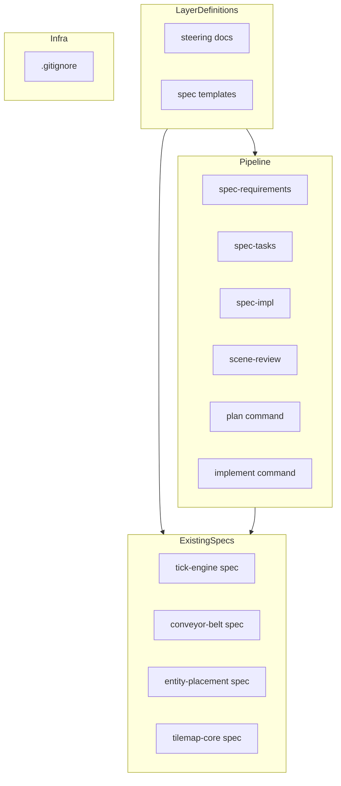
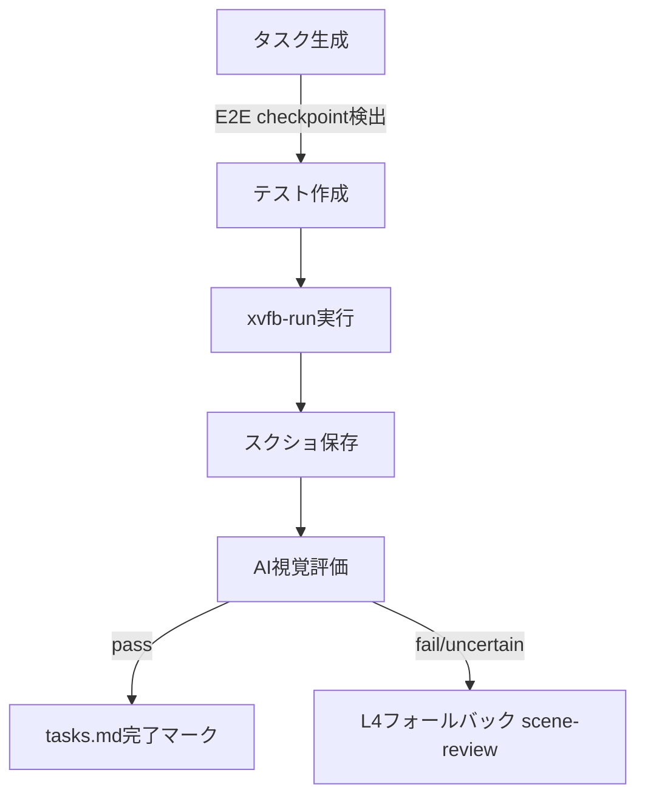

# Design Document: e2e-test-automation

## Overview
**Purpose**: テストレイヤー体系にL3 E2Eテスト層を新設し、旧L3ヒューマンレビューをL4に移行することで、AI視覚評価による自動検証を可能にする。
**Users**: 開発者（spec-impl実行者、specテンプレート利用者）がE2Eテストの自動実行と結果評価に活用する。
**Impact**: プロジェクト全体のテストレイヤー定義、specテンプレート、コマンド定義、既存specファイル計20ファイルを一貫して更新する。

### Goals
- テストレイヤー体系を3層から4層に拡張し、L3にE2Eテスト（SceneRunner+スクショ+AI視覚評価）を位置付ける
- 旧L3（ヒューマンレビュー）をL4に移行し、既存specとの後方互換性を維持する
- E2Eテストの実装パターン（フィルムストリップパターン、スクショ戦略）を標準化する
- すべてのドキュメント間でレイヤー参照の一貫性を確保する

### Non-Goals
- E2Eテストの実装コード自体の作成（テストスクリプトの実装は対象外）
- 既存L1/L2テストの変更
- CI/CDパイプラインの変更（`.gitignore`のみ対象）
- AI視覚評価エンジンの実装（既存のReadツール+LLM評価を使用）

## Architecture

### Existing Architecture Analysis
現在のテスト体系は3層（L1: Unit, L2: Integration, L3: Human Review）で構成されている。L3は人的判断に依存しており、自動化の余地がある項目（スクショ比較、メトリクス計測）も含まれている。

変更対象はすべてMarkdown/JSONドキュメントファイルであり、GDScriptコードの変更は不要。既存のGdUnit4/SceneRunner/xvfb-run基盤をそのまま活用する。

### Architecture Pattern & Boundary Map

**Architecture Integration**:
- Selected pattern: カテゴリ別順次更新 — 定義→パイプライン→既存spec→インフラの順で変更を伝播
- Domain/feature boundaries: ドキュメント変更のみで、ランタイムコードへの影響なし
- Existing patterns preserved: 既存のEARS形式要件、GdUnit4テストパターン、spec駆動開発フロー
- Steering compliance: testing.md/tech.mdの既存構造を維持しつつ拡張

### Technology Stack

| Layer | Choice / Version | Role in Feature | Notes |
|-------|------------------|-----------------|-------|
| Documentation | Markdown / JSON | レイヤー定義、テンプレート、spec、コマンド | 全変更対象 |
| Testing Framework | GdUnit4 | E2Eテストの基盤（既存） | SceneRunner, simulate_* API |
| Virtual Display | xvfb-run | E2Eテスト実行環境（既存） | X11仮想ディスプレイ |
| Screenshot API | Godot Viewport | スクショ取得（既存） | get_texture().get_image().save_png() |

## System Flows

このフローはspec-implコマンドに文書化するE2E checkpoint実行手順を示す。

## Requirements Traceability

| Requirement | Summary | Components | Interfaces | Flows |
|-------------|---------|------------|------------|-------|
| 1.1-1.4 | レイヤー体系再定義 | SteeringUpdater | — | — |
| 2.1-2.2 | specテンプレート更新 | TemplateUpdater | — | — |
| 3.1-3.4 | タスク生成パイプライン更新 | TaskPipelineUpdater | — | E2E checkpoint flow |
| 4.1-4.3 | 実装パイプラインE2E対応 | ImplPipelineUpdater | — | E2E checkpoint flow |
| 5.1-5.2 | scene-review L4対応 | SceneReviewUpdater | — | L4 fallback |
| 6.1-6.8 | 既存spec移行 | SpecMigrator | — | — |
| 7.1-7.2 | plan/implementコマンド更新 | CommandUpdater | — | — |
| 8.1 | .gitignore更新 | InfraUpdater | — | — |
| 9.1-9.3 | E2Eテストパターン文書化 | SteeringUpdater | — | — |
| 10.1-10.2 | 一貫性検証 | VerificationStep | — | — |

## Components and Interfaces

| Component | Domain/Layer | Intent | Req Coverage | Key Dependencies | Contracts |
|-----------|-------------|--------|--------------|------------------|-----------|
| SteeringUpdater | A. レイヤー定義 | steering docs のレイヤー定義更新 | 1, 9 | testing.md, tech.md (P0) | — |
| TemplateUpdater | A. レイヤー定義 | specテンプレートのレイヤー定義更新 | 2 | requirements.md template, design.md template (P0) | — |
| TaskPipelineUpdater | B. パイプライン | タスク生成ルール・テンプレート・コマンドの更新 | 3 | tasks-generation.md, tasks.md template, spec-tasks.md (P0) | — |
| ImplPipelineUpdater | B. パイプライン | 実装コマンドのE2E対応 | 4 | spec-impl.md, spec-requirements.md (P0) | — |
| SceneReviewUpdater | B. パイプライン | scene-reviewのL4更新 | 5 | scene-review.md (P0) | — |
| CommandUpdater | B. パイプライン | plan/implementコマンドの更新 | 7 | plan.md, implement.md (P0) | — |
| SpecMigrator | C. 既存spec | 既存specのレイヤー参照移行 | 6 | tick-engine, conveyor-belt, entity-placement, tilemap-core specs (P0) | — |
| InfraUpdater | D. インフラ | .gitignoreの更新 | 8 | .gitignore (P0) | — |
| VerificationStep | 検証 | Layer 3参照の一貫性検証 | 10 | 全変更対象ファイル (P0) | — |

### A. レイヤー定義

#### SteeringUpdater

| Field | Detail |
|-------|--------|
| Intent | steering docsにL3 E2E層定義を追加し、旧L3をL4に移行する |
| Requirements | 1.1, 1.2, 1.3, 1.4, 9.1, 9.2, 9.3 |

**Responsibilities & Constraints**
- `testing.md`: L3 E2Eテスト層の定義追加、L3/L4振り分け基準の明記、E2Eテストパターン節・フィルムストリップパターン・スクショ戦略テーブルの追加
- `tech.md`: テストセクションのLayer 3記述をE2Eテストに変更し、Layer 4としてヒューマンレビューを追加
- 既存のL1/L2定義は変更しない

**変更対象ファイル**
- `.kiro/steering/testing.md`
- `.kiro/steering/tech.md`

#### TemplateUpdater

| Field | Detail |
|-------|--------|
| Intent | specテンプレートのレイヤー定義コメントを4層体系に更新する |
| Requirements | 2.1, 2.2 |

**Responsibilities & Constraints**
- `requirements.md`テンプレート: Layer定義コメントにL3 E2Eを追加、旧Layer 3をLayer 4に更新
- `design.md`テンプレート: Testing StrategyセクションのLayer 3をE2E Testに変更し、Layer 4 Human Reviewを追加

**変更対象ファイル**
- `.kiro/settings/templates/specs/requirements.md`
- `.kiro/settings/templates/specs/design.md`

### B. タスク生成・実行パイプライン

#### TaskPipelineUpdater

| Field | Detail |
|-------|--------|
| Intent | タスク生成ルール・テンプレート・コマンドにE2E checkpointパターンを追加する |
| Requirements | 3.1, 3.2, 3.3, 3.4 |

**Responsibilities & Constraints**
- `tasks-generation.md`: レイヤー順序付けにL3 E2Eルール追加、`E2E checkpoint:`パターンの定義
- `tasks.md`テンプレート: E2E checkpointフォーマット例の追加
- `spec-tasks.md`コマンド: L3 E2E checkpoint生成ルール、L3/L4振り分け基準の追加

**変更対象ファイル**
- `.kiro/settings/rules/tasks-generation.md`
- `.kiro/settings/templates/specs/tasks.md`
- `.claude/commands/kiro/spec-tasks.md`

#### ImplPipelineUpdater

| Field | Detail |
|-------|--------|
| Intent | spec-implおよびspec-requirementsコマンドにE2E実行フローを追加する |
| Requirements | 4.1, 4.2, 4.3 |

**Responsibilities & Constraints**
- `spec-impl.md`: L3 E2E checkpoint実行フロー追加（テスト作成→xvfb実行→スクショ保存→AI評価）、Human review参照のL4更新
- `spec-requirements.md`: L3 E2E層の説明追加、旧L3参照のL4更新

**変更対象ファイル**
- `.claude/commands/kiro/spec-impl.md`
- `.claude/commands/kiro/spec-requirements.md`

#### SceneReviewUpdater

| Field | Detail |
|-------|--------|
| Intent | scene-reviewコマンドをL4ヒューマンレビューとして再定義する |
| Requirements | 5.1, 5.2 |

**Responsibilities & Constraints**
- description/本文をL4に更新
- スクショ自動読み込みモードの追加（E2Eテストで保存されたスクショを活用）

**変更対象ファイル**
- `.claude/commands/kiro/scene-review.md`

#### CommandUpdater

| Field | Detail |
|-------|--------|
| Intent | plan/implementコマンドのレイヤー参照を更新する |
| Requirements | 7.1, 7.2 |

**変更対象ファイル**
- `.claude/commands/plan.md`
- `.claude/commands/implement.md`

### C. 既存spec移行

#### SpecMigrator

| Field | Detail |
|-------|--------|
| Intent | 既存specのレイヤー参照を新体系に移行する |
| Requirements | 6.1, 6.2, 6.3, 6.4, 6.5, 6.6, 6.7, 6.8 |

**Responsibilities & Constraints**
- tick-engine: requirements.md/design.md → L3 E2E、tasks.md `Human review:` → `E2E checkpoint:`
- conveyor-belt: requirements.md/design.md → L3 E2E、tasks.md `Human review:` → `E2E checkpoint:`
- entity-placement: design.md → L4（完了済み）
- tilemap-core: design.md → L4

**振り分け判断基準**:
- tick-engine: 性能メトリクス・応答時間はメトリクス計測で客観的に判定可能 → L3 E2E
- conveyor-belt: 視覚品質はスクショ比較で判定可能 → L3 E2E
- entity-placement: 完了済みのヒューマンレビュー → L4（既存結果を維持）
- tilemap-core: → L4

**変更対象ファイル**
- `.kiro/specs/tick-engine/requirements.md`, `design.md`, `tasks.md`
- `.kiro/specs/conveyor-belt/requirements.md`, `design.md`, `tasks.md`
- `.kiro/specs/entity-placement/design.md`, `tasks.md`
- `.kiro/specs/tilemap-core/design.md`

### D. インフラ

#### InfraUpdater

| Field | Detail |
|-------|--------|
| Intent | E2Eテストのスクショ成果物をGit管理から除外する |
| Requirements | 8.1 |

**変更対象ファイル**
- `.gitignore`

### 検証

#### VerificationStep

| Field | Detail |
|-------|--------|
| Intent | 全変更完了後にLayer 3参照の一貫性を検証する |
| Requirements | 10.1, 10.2 |

**Responsibilities & Constraints**
- `grep -r "Layer 3" .kiro/steering/ .kiro/settings/ .claude/commands/ | grep -v "E2E"` で残存する旧Layer 3参照を検出
- 検出された場合は該当箇所を報告し修正

## Testing Strategy

### Layer 1: Unit Tests (Pure Logic)
この機能はドキュメント変更のみであり、ランタイムコードの変更は含まれないため、従来のユニットテストは不要。代わりに以下の内容検証を実施:
- 各変更対象ファイルにおけるLayer参照の正確性
- E2E checkpointフォーマットの構文正確性
- テンプレートプレースホルダーの整合性

### Layer 3: E2E Test
- 最終検証: `grep -r "Layer 3" .kiro/steering/ .kiro/settings/ .claude/commands/ | grep -v "E2E"` で旧Layer 3参照が残っていないことを確認
- 変更対象20ファイルすべてが更新されていることを確認

### Layer 4: Human Review
- 文書の可読性と一貫性の確認
- E2Eテストパターンの記述が開発者にとって理解しやすいことの確認
