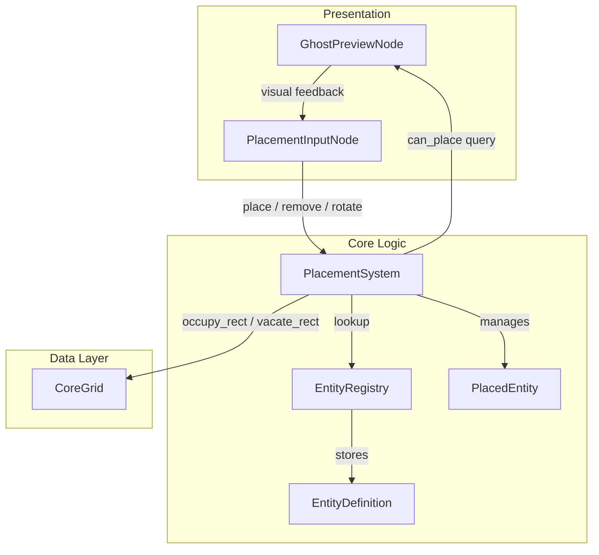
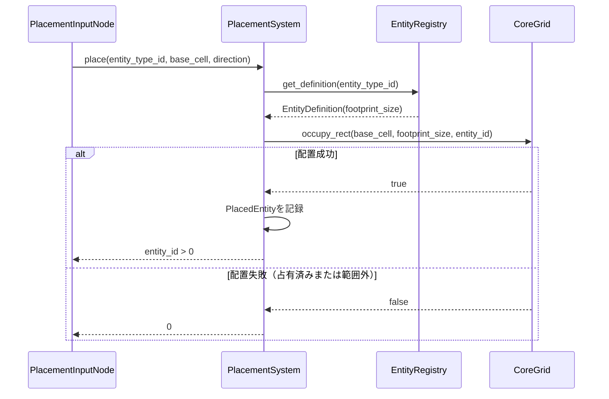
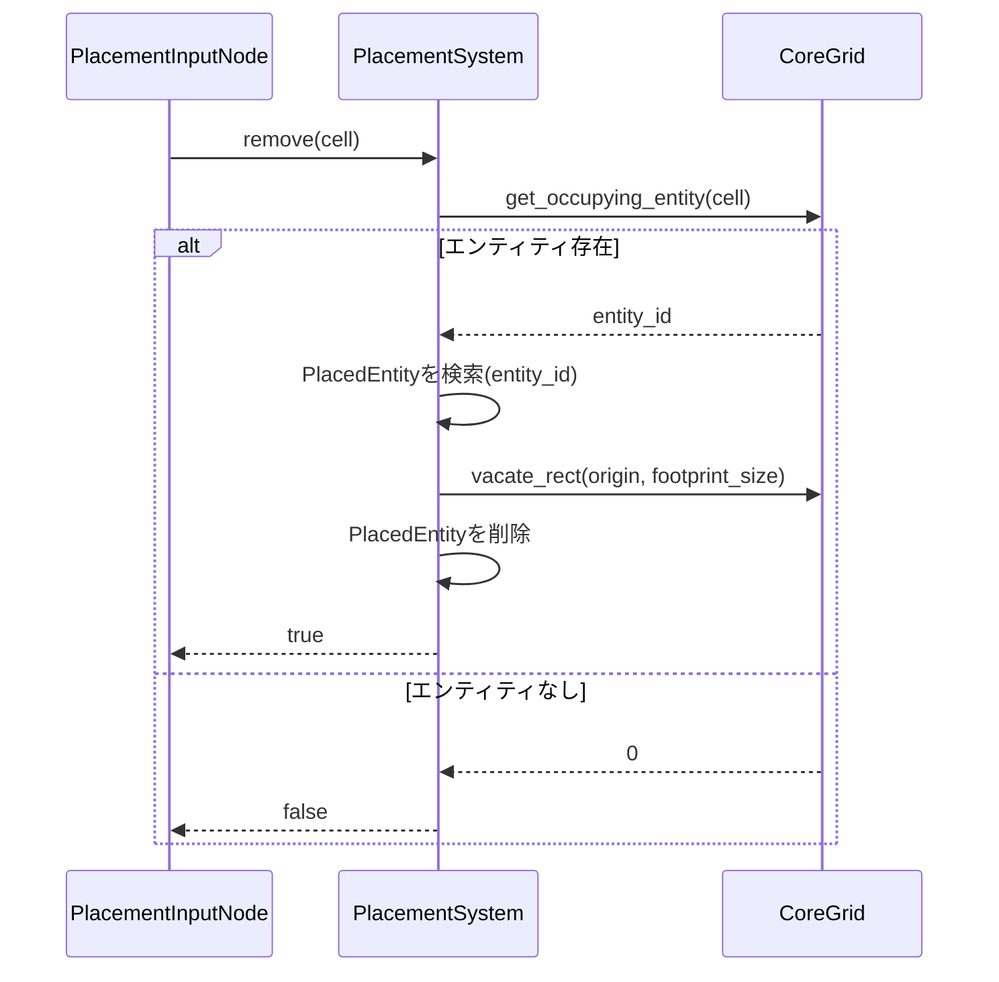
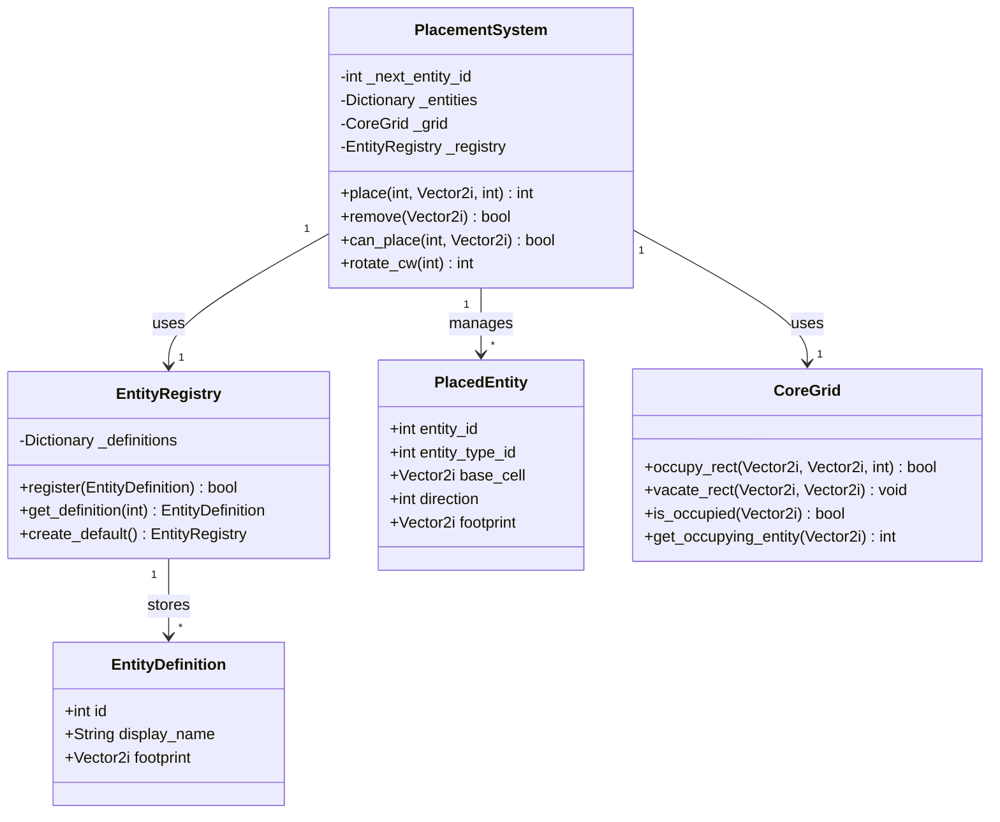

# Design Document: Entity Placement

## Overview

**Purpose**: Entity Placement（配置・撤去システム）は、プレイヤーがグリッド上にエンティティ（Miner, Smelter, Belt, DeliveryBox）を配置・回転・撤去し、ゴーストプレビューで配置可否を事前確認できる機能を提供する。

**Users**: ファクトリービルダーのプレイヤーが工場レイアウトの構築・変更に使用する。

**Impact**: 既存のCoreGridの占有管理機能を活用し、上位レイヤーとしてPlacementSystemを導入する。

**注記**: MVPエンティティのフットプリントはすべて1x1（Miner, Smelter, Belt, DeliveryBox）。product.md（steering）の記述（Miner:2x2, Smelter:2x2）との齟齬は、上流のspec修正に基づく意図的な変更であり、steeringドキュメントは別途更新される。汎用矩形フットプリントアーキテクチャは将来拡張用に維持する。

### Goals
- グリッド上でのエンティティ配置・撤去をフットプリント検証付きで実現する
- 4方向回転による方向制御を提供する
- ゴーストプレビューによる配置可否の視覚フィードバックを実現する
- 既存CoreGridアーキテクチャとの一貫性を維持する

### Non-Goals
- 建設コスト（資源消費）による配置制限
- 配置・撤去のアニメーション演出
- ブループリント（一括配置テンプレート）
- ドラッグによるベルトの連続配置
- ポート（入出力口）の接続解決
- 撤去時の内容物・接続状態のクリーンアップ

## Architecture

### Existing Architecture Analysis

既存のCoreGridシステムが占有管理の基盤を提供している:

- `CoreGrid`（RefCounted）: 64x64グリッドのセル管理（地形、資源、占有状態）
- `CoreGrid.occupy_rect` / `vacate_rect`: 矩形領域の原子的な占有・解放（2パス検証+コミット）
- `Enums.Direction`: N/E/S/Wの4方向enum（int値: 0-3）
- `ItemDefinition` / `ItemCatalog`: アイテム定義のカタログパターン（値オブジェクト + レジストリ）

これらの既存パターンを拡張し、新規コンポーネントは同じ設計方針に従う。

### Architecture Pattern & Boundary Map



**Architecture Integration**:
- **Selected pattern**: レイヤードアーキテクチャ（Data Layer → Core Logic → Presentation）— tech.mdのハイブリッドデータ指向方針に準拠
- **Domain boundaries**: PlacementSystem = 配置ビジネスロジック、CoreGrid = セルデータ管理、Presentation = 入力処理と描画
- **Existing patterns preserved**: RefCountedベースのコアロジック、SceneTree非依存、カタログパターン
- **New components rationale**: EntityDefinition/EntityRegistry（エンティティ種別の定義管理）、PlacedEntity（配置済み状態の管理）、PlacementSystem（配置・撤去・回転のビジネスロジック統合）
- **Steering compliance**: ロジック≠プレゼンテーション分離、依存性注入、静的型付け

### Technology Stack

| Layer | Choice / Version | Role in Feature | Notes |
|-------|------------------|-----------------|-------|
| Simulation / Core Logic | GDScript (Godot 4.3+) | PlacementSystem, EntityDefinition, EntityRegistry, PlacedEntity | RefCountedベース、SceneTree非依存 |
| Presentation / UI | Godot Node / Sprite2D | GhostPreviewNode, PlacementInputNode | 薄いアダプター、Core Logicに委譲 |
| Data / Storage | CoreGrid (既存) | セル占有状態の管理 | 既存API活用（occupy_rect, vacate_rect） |
| Events / Messaging | Godot Signal | 配置/撤去の通知 | Presentation↔Logic間のみ |

## System Flows

### 配置フロー



### 撤去フロー



## Requirements Traceability

| Requirement | Summary | Components | Interfaces | Flows |
|-------------|---------|------------|------------|-------|
| 1.1-1.5 | エンティティ配置 | PlacementSystem, CoreGrid | PlacementSystem.place() | 配置フロー |
| 2.1-2.5 | 配置検証 | PlacementSystem, CoreGrid | PlacementSystem.can_place() | 配置フロー |
| 3.1-3.4 | エンティティ回転 | PlacementSystem | PlacementSystem.rotate(), PlacedEntity.direction | - |
| 4.1-4.6 | エンティティ撤去 | PlacementSystem, CoreGrid | PlacementSystem.remove() | 撤去フロー |
| 5.1-5.4 | ゴーストプレビュー | GhostPreviewNode, PlacementSystem | PlacementSystem.can_place() | - |
| 6.1-6.3 | 配置・撤去の原子性 | PlacementSystem, CoreGrid | CoreGrid.occupy_rect() | 配置・撤去フロー |
| 7.1-7.5 | エンティティ定義参照 | EntityDefinition, EntityRegistry | EntityRegistry.get_definition() | - |

## Components and Interfaces

| Component | Domain/Layer | Intent | Req Coverage | Key Dependencies | Contracts |
|-----------|-------------|--------|--------------|------------------|-----------|
| EntityDefinition | Core | エンティティ種別のフットプリントと表示名を保持する値オブジェクト | 7.1-7.5 | なし | State |
| EntityRegistry | Core | エンティティ定義の登録・検索を一元管理 | 7.1-7.5 | EntityDefinition (P0) | Service |
| PlacedEntity | Core | 配置済みエンティティの状態を保持する値オブジェクト | 1.3, 1.4, 3.3, 4.2 | なし | State |
| PlacementSystem | Core | 配置・撤去・回転のビジネスロジック | 1.1-6.3 | CoreGrid (P0), EntityRegistry (P0) | Service |
| GhostPreviewNode | Presentation | ゴーストプレビューの描画 | 5.1-5.4 | PlacementSystem (P0) | State |

### Core Logic

#### EntityDefinition

| Field | Detail |
|-------|--------|
| Intent | エンティティ種別の定義情報（ID、表示名、フットプリントサイズ）を保持する不変の値オブジェクト |
| Requirements | 7.1, 7.2, 7.3, 7.4, 7.5 |

**Responsibilities & Constraints**
- エンティティ種別のフットプリントサイズ（Vector2i）と表示名を保持する
- 不変（イミュータブル）の値オブジェクトとして機能する
- フットプリントは矩形のみ（7.5）

**Dependencies**
- なし（自己完結型の値オブジェクト）

**Contracts**: State [x]

##### State Management
```gdscript
class_name EntityDefinition
extends RefCounted

var id: int              ## エンティティ種別の一意ID（正の整数、0は予約）
var display_name: String ## 表示名
var footprint: Vector2i  ## フットプリントサイズ（例: Vector2i(1, 1)。矩形フットプリントは汎用サポート）
```
- Preconditions: `id > 0`, `display_name != ""`, `footprint.x > 0 and footprint.y > 0`
- Invariants: 生成後は不変

```gdscript
func is_valid() -> bool
## Postconditions: Preconditionsを全て満たす場合true、それ以外false
```

#### EntityRegistry

| Field | Detail |
|-------|--------|
| Intent | エンティティ定義の登録・検索を一元管理するカタログ |
| Requirements | 7.1, 7.2, 7.3, 7.4, 7.5 |

**Responsibilities & Constraints**
- ID → EntityDefinitionのマッピングを管理する
- 同一IDの重複登録を拒否する
- MVP初期データの静的ファクトリメソッドを提供する

**Dependencies**
- Inbound: PlacementSystem — エンティティ定義の参照 (P0)

**Contracts**: Service [x]

##### Service Interface
```gdscript
class_name EntityRegistry
extends RefCounted

func register(definition: EntityDefinition) -> bool
## Preconditions: definition != null
## Postconditions: 未登録IDなら登録してtrue、既登録ならfalse

func get_definition(entity_type_id: int) -> EntityDefinition
## Postconditions: 有効IDならEntityDefinition、無効なら null

func size() -> int

static func create_default() -> EntityRegistry
## Postconditions: Miner(1x1), Smelter(1x1), Belt(1x1), DeliveryBox(1x1)が登録済み
```

#### PlacedEntity

| Field | Detail |
|-------|--------|
| Intent | 配置済みエンティティの状態（位置、種別、方向）を保持する値オブジェクト |
| Requirements | 1.3, 1.4, 3.3, 4.2 |

**Responsibilities & Constraints**
- 配置済みエンティティのメタデータ（entity_id, entity_type_id, 基準セル, 方向, フットプリント）を保持する
- entity_idはPlacementSystemが採番する

**Dependencies**
- なし（自己完結型の値オブジェクト）

**Contracts**: State [x]

##### State Management
```gdscript
class_name PlacedEntity
extends RefCounted

var entity_id: int            ## 配置済みエンティティの一意ID
var entity_type_id: int       ## EntityDefinitionのID
var base_cell: Vector2i       ## 基準セル（フットプリントの左上）
var direction: int            ## Enums.Direction（N=0, E=1, S=2, W=3）
var footprint: Vector2i       ## フットプリントサイズ（EntityDefinitionから取得）
```

#### PlacementSystem

| Field | Detail |
|-------|--------|
| Intent | 配置・撤去・回転のビジネスロジックを統合する中核システム |
| Requirements | 1.1-1.5, 2.1-2.5, 3.1-3.4, 4.1-4.6, 5.1-5.4, 6.1-6.3 |

**Responsibilities & Constraints**
- エンティティの配置（フットプリント検証 → CoreGrid占有 → PlacedEntity記録）
- エンティティの撤去（entity_id特定 → CoreGrid解放 → PlacedEntity削除）
- 配置可否の問い合わせ（ゴーストプレビュー用）
- 回転方向の管理（選択中エンティティの方向切り替え）
- entity_idの自動採番
- PlacementSystemを経由しないCoreGrid直接操作を許容しない設計

**Dependencies**
- Outbound: CoreGrid — セル占有の参照・更新 (P0)
- Outbound: EntityRegistry — エンティティ定義の参照 (P0)

**Contracts**: Service [x]

##### Service Interface
```gdscript
class_name PlacementSystem
extends RefCounted

func place(entity_type_id: int, base_cell: Vector2i, direction: int) -> int
## Preconditions: entity_type_id はEntityRegistryに登録済み
## Postconditions:
##   成功時: entity_id (正の整数) を返す。CoreGridの該当セルが占有される。PlacedEntityが記録される。
##   失敗時: 0 を返す。CoreGridの状態は変更されない。
## 失敗条件: フットプリント内にグリッド範囲外または占有済みセルが存在する

func remove(cell: Vector2i) -> bool
## Postconditions:
##   エンティティ存在時: true。CoreGridの該当セルが解放される。PlacedEntityが削除される。
##   エンティティなし時: false。CoreGridの状態は変更されない。

func can_place(entity_type_id: int, base_cell: Vector2i) -> bool
## Postconditions: フットプリント全体が空きかつグリッド範囲内ならtrue、それ以外false
## 副作用なし（クエリ専用）

func get_placed_entity(entity_id: int) -> PlacedEntity
## Postconditions: 有効IDならPlacedEntity、無効ならnull

func get_entity_at(cell: Vector2i) -> PlacedEntity
## Postconditions: 占有セルならPlacedEntity、未占有ならnull

func get_all_entities() -> Array
## Postconditions: 全PlacedEntityの配列を返す（読み取り専用）

static func rotate_cw(direction: int) -> int
## Postconditions: (direction + 1) % 4 を返す（N→E→S→W→N）
```
- Invariants: PlacedEntityの記録とCoreGridの占有状態は常に同期している

**Implementation Notes**
- `_next_entity_id: int` カウンタでentity_idを自動採番（1から開始）
- `_entities: Dictionary = {}` で `entity_id -> PlacedEntity` のマッピングを管理
- CoreGridの`occupy_rect`が2パス検証+コミットを行うため、PlacementSystemでの重複検証は不要
- Presentation層のPlacementInputNodeは `entity_placed(entity_id, pos, direction, entity_type_id)` / `entity_removed(entity_id, pos, entity_type_id)` シグナルを発行（外部連携用）。**既知の制約**: これらのシグナルはPresentation層にあるため、非UI経路（ロード、スクリプト配置等）からの配置・撤去時に発火しない。MVP後にシーンレベルのコーディネーターまたはPlacementSystemからの型付き結果イベントへの移行を検討する
- PlacementInputNodeがエンティティ定義参照のため`_registry`に直接アクセスしている点が既知。**設計上の懸念**: レイヤー間の内部状態漏洩。PlacementSystemに `get_definition(entity_type_id) -> EntityDefinition` クエリメソッドを追加し、Presentation層からの直接アクセスを解消すべき（将来課題）

### Presentation

#### GhostPreviewNode

| Field | Detail |
|-------|--------|
| Intent | 配置予定位置にゴースト（半透明）プレビューを描画する |
| Requirements | 5.1, 5.2, 5.3, 5.4 |

**Responsibilities & Constraints**
- 選択中エンティティのフットプリントに基づきゴーストスプライトを表示する
- PlacementSystem.can_place()の結果に応じて緑色/赤色を切り替える
- マウス移動に追従してゴースト位置を更新する

**Dependencies**
- Inbound: PlacementInputNode — 対象セルの通知 (P0)
- Outbound: PlacementSystem — can_place()クエリ (P0)

**Contracts**: State [x]

**Implementation Notes**
- Node2Dベースで`_draw()`メソッドによるカスタム描画を使用。`draw_rect()`でフットプリント領域を描画する。
- 色制御は`Color`定数で管理: `COLOR_VALID = Color(0.0, 1.0, 0.0, 0.5)`（緑半透明）、`COLOR_INVALID = Color(1.0, 0.0, 0.0, 0.5)`（赤半透明）。
- `CELL_SIZE: int = 64` でピクセル座標変換を行う。
- 公開API: `set_entity_type(entity_type_id, footprint)`, `update_target_cell(cell)`

## Data Models

### Domain Model



### Logical Data Model

**Structure Definition**:
- `EntityRegistry`: `Dictionary<int, EntityDefinition>` — entity_type_id → EntityDefinition
- `PlacementSystem._entities`: `Dictionary<int, PlacedEntity>` — entity_id → PlacedEntity
- `CoreGrid._occupancy`: `Dictionary<Vector2i, int>` — セル座標 → entity_id（既存）

**Consistency & Integrity**:
- PlacementSystemが唯一の変更経路。CoreGridの`_occupancy`とPlacementSystemの`_entities`は常にPlacementSystem経由で同期する
- entity_idの一意性は`_next_entity_id`の単調増加で保証

## Error Handling

### Error Strategy
PlacementSystemのメソッドは戻り値で成否を通知する（例外は使用しない）。

### Error Categories and Responses
- **配置失敗（占有済み）**: `place()` が 0 を返す。グリッド状態は変更されない
- **配置失敗（範囲外）**: `place()` が 0 を返す。グリッド状態は変更されない
- **撤去失敗（エンティティなし）**: `remove()` が false を返す。グリッド状態は変更されない
- **不正なentity_type_id**: `place()` が 0 を返す（EntityRegistryで見つからない場合）

## Testing Strategy

### Layer 1: Unit Tests (Pure Logic)
- **PlacementSystem.place()**: 空きセルへの配置成功と占有状態の検証
- **PlacementSystem.place()**: 占有済みセル・範囲外セルへの配置拒否
- **PlacementSystem.remove()**: 配置済みエンティティの撤去と占有解放
- **PlacementSystem.remove()**: 矩形フットプリントエンティティの任意セル指定による撤去（テスト専用の多セルエンティティ定義を使用）
- **PlacementSystem.rotate_cw()**: N→E→S→W→Nの回転サイクル
- **PlacementSystem.can_place()**: 配置可否の正確な判定
- **EntityRegistry.create_default()**: MVPエンティティの定義検証
- **配置・撤去の原子性**: 失敗時にグリッド状態が変更されないことの検証

### Layer 2: Integration Tests (Constraint Verification)
- ゴーストプレビューの色がcan_place()の結果と一致すること
- 配置→撤去→再配置のサイクルが正しく動作すること
- 複数エンティティの連続配置が占有状態を正しく累積すること

### Layer 4: Human Review (Non-Testable)
- ゴーストの半透明度が視覚的に適切であること — スクリーンショットで目視確認
- ゴースト表示がマウス移動に体感遅延なく追従すること — リアルタイム操作で確認
- 配置・撤去操作のレスポンスと操作感 — プレイテストで確認

## Implementation Changelog

| 日付 | カテゴリ | 変更内容 |
|------|---------|---------|
| 2026-03-16 | [INTERFACE] | PlacementSystem.get_all_entities() を追加 — GameStateDumpによる状態スナップショット用 |
| 2026-03-16 | [INTERFACE] | EntityDefinition.is_valid() を追加 — Preconditions検証ヘルパー |
