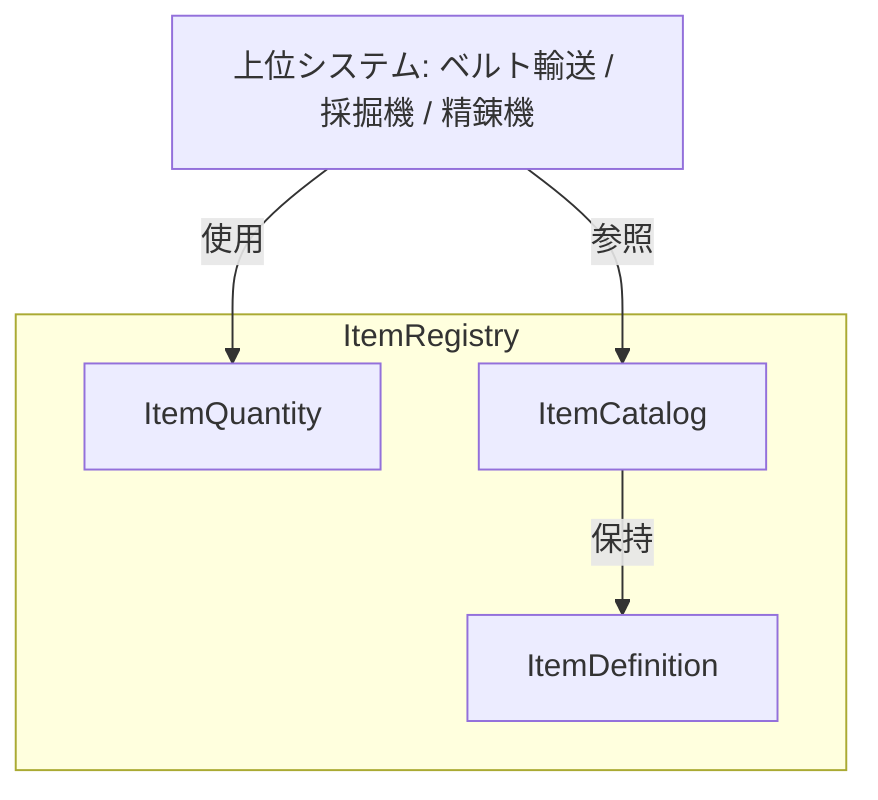
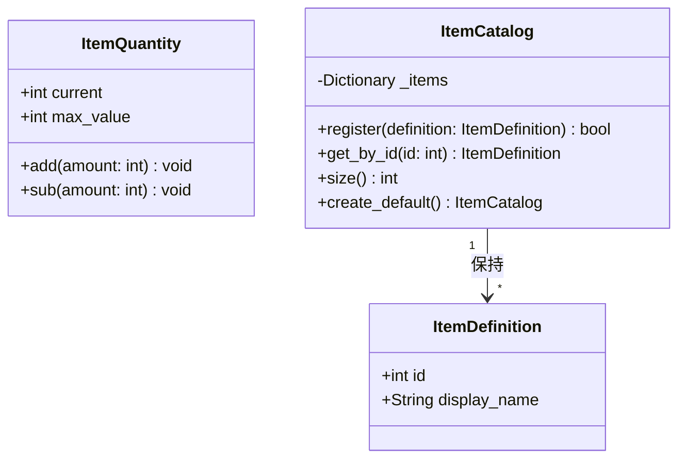

# Design Document — Item Registry

## Overview
**Purpose**: ゲーム内で流通するアイテムの種別を一意に識別し、定義情報を一元管理する基盤機能を提供する。ベルト輸送・機械加工・納品カウントなど、すべてのアイテム関連システムが共通のアイテム定義を参照できるようにする。

**Users**: アイテムを生成・輸送・加工・計数するゲームプレイシステムが、アイテム種別の識別と数量管理に利用する。

### Goals
- アイテム種別の定義（ID + 表示名）を一元管理する
- IDによるアイテム定義の検索・取得を提供する
- 数量値の安全な増減（範囲クランプ）を提供する
- MVPとして鉄鉱石（ID=1）と精錬鉄（ID=2）の2種を初期登録する
- シーンツリーに依存しない純粋データ構造として実装する

### Non-Goals
- アイテムのビジュアル（スプライト、アイコン）定義
- レシピ定義（入力→出力の変換ルール）
- スタック数制限やインベントリ管理
- アイテムのカテゴリ分類やタグ付け
- ディスクへの永続化

## Architecture

### Architecture Pattern & Boundary Map



**Architecture Integration**:
- **Selected pattern**: 単純RefCountedクラス群 — 既存のcore/クラス（TickClock、GridCellData）と同じアプローチ。外部依存がなく、純粋データ定義のため複雑なアーキテクチャは不要。
- **Domain boundaries**: ItemRegistryはアイテム定義ドメインを担当し、上位システム（輸送・加工等）とは参照のみの関係。
- **Existing patterns preserved**: `RefCounted`ベース、`class_name`グローバル登録、`scripts/core/`配置
- **New components rationale**: ItemDefinition（値オブジェクト）、ItemQuantity（数量管理）、ItemCatalog（一覧管理）の3コンポーネントが必要。各コンポーネントは単一責任を持つ。

### Technology Stack

| Layer | Choice / Version | Role in Feature | Notes |
|-------|------------------|-----------------|-------|
| Simulation / Core Logic | GDScript (Godot 4.3) | アイテム定義・数量管理・カタログの純粋ロジック | 既存パターンと整合 |
| Data / Storage | Dictionary (in-memory) | ID→ItemDefinitionの高速検索 | O(1)ルックアップ |
| Infrastructure / Runtime | RefCounted | メモリ管理、シーン非依存 | Node不要 |
| Testing | gdUnit4 | ユニットテスト | GdUnitTestSuite |

## Requirements Traceability

| Requirement | Summary | Components | Interfaces | Flows |
|-------------|---------|------------|------------|-------|
| 1.1 | 一意な正の整数IDと表示名を保持 | ItemDefinition | コンストラクタ | — |
| 1.2 | ID=0を予約値として扱う | ItemDefinition, ItemCatalog | get_by_id | — |
| 1.3 | IDと表示名を不変属性として保持 | ItemDefinition | — | — |
| 2.1 | 新しいアイテム定義をカタログに追加 | ItemCatalog | register | 登録フロー |
| 2.2 | 同一IDの重複登録を拒否 | ItemCatalog | register | 登録フロー |
| 2.3 | 追加登録で既存定義を変更しない | ItemCatalog | register | — |
| 3.1 | 有効なIDで検索し定義を返す | ItemCatalog | get_by_id | 検索フロー |
| 3.2 | 存在しないIDでnullを返す | ItemCatalog | get_by_id | 検索フロー |
| 3.3 | ID=0でnullを返す | ItemCatalog | get_by_id | 検索フロー |
| 4.1 | 0以上かつ上限値以下の値を保持 | ItemQuantity | コンストラクタ | — |
| 4.2 | 加算で数量を増加 | ItemQuantity | add | 数量操作フロー |
| 4.3 | 減算で数量を減少 | ItemQuantity | sub | 数量操作フロー |
| 4.4 | 加算結果が上限超過時にクランプ | ItemQuantity | add | 数量操作フロー |
| 4.5 | 減算結果が0未満時にクランプ | ItemQuantity | sub | 数量操作フロー |
| 5.1, 5.2 | MVP初期データ（鉄鉱石・精錬鉄） | ItemCatalog | create_default | — |
| 5.3, 5.4 | MVP初期データのID検索 | ItemCatalog | get_by_id | 検索フロー |
| 6.1 | シーンツリーなしでインスタンス化 | 全コンポーネント | — | — |
| 6.2 | シーン状態なしで全機能提供 | 全コンポーネント | — | — |
| 6.3 | シーンノード非依存データ構造 | ItemDefinition | — | — |

## Components and Interfaces

| Component | Domain/Layer | Intent | Req Coverage | Key Dependencies | Contracts |
|-----------|--------------|--------|--------------|-----------------|-----------|
| ItemDefinition | Core / Data | アイテム種別の定義情報を保持する値オブジェクト | 1.1, 1.2, 1.3, 6.3 | なし | State |
| ItemQuantity | Core / Data | アイテム数量の安全な増減と範囲クランプ | 4.1, 4.2, 4.3, 4.4, 4.5 | なし | State |
| ItemCatalog | Core / Service | アイテム定義の登録・検索を一元管理 | 2.1, 2.2, 2.3, 3.1, 3.2, 3.3, 5.1-5.4, 6.1, 6.2 | ItemDefinition (P0) | Service, State |

### Core / Data

#### ItemDefinition

| Field | Detail |
|-------|--------|
| Intent | アイテム種別の定義情報（ID + 表示名）を保持する不変の値オブジェクト |
| Requirements | 1.1, 1.2, 1.3, 6.3 |

**Responsibilities & Constraints**
- 一意な正の整数IDと空でない表示名を保持する
- ID=0は予約値であり、有効なアイテム定義に割り当てない
- 生成後にIDと表示名は変更されない（イミュータブル）
- シーンノードに依存しない純粋データ構造

**Dependencies**
- なし（依存ゼロの値オブジェクト）

**Contracts**: State [x]

##### State Management
- State model: `id: int`（正の整数）、`display_name: String`（空でない文字列）
- Persistence: インメモリのみ（永続化はスコープ外）
- Concurrency: 不変オブジェクトのため競合なし

**Implementation Notes**
- `RefCounted`を継承し、`class_name ItemDefinition`でグローバル登録
- `godot/scripts/core/item_definition.gd`に配置
- コンストラクタでID > 0およびdisplay_name非空のアサーションを行う

#### ItemQuantity

| Field | Detail |
|-------|--------|
| Intent | アイテム数量の安全な増減と範囲クランプを提供する |
| Requirements | 4.1, 4.2, 4.3, 4.4, 4.5 |

**Responsibilities & Constraints**
- 数量値を0以上かつ上限値以下の有効範囲内に保持する
- 加算・減算の結果が範囲外になった場合はクランプする（エラーを発生させない）
- 上限値は生成時に指定し、デフォルトは999

**Dependencies**
- なし（独立した値管理クラス）

**Contracts**: State [x]

##### State Management
- State model: `current: int`（0 <= current <= max_value）、`max_value: int`（上限値）
- Persistence: インメモリのみ
- Concurrency: 単一スレッドアクセスを前提

##### Service Interface
```gdscript
class_name ItemQuantity
extends RefCounted

## 数量値の上限デフォルト値
const DEFAULT_MAX: int = 999

## 現在の数量値（読み取り専用）
var current: int

## 上限値（読み取り専用）
var max_value: int

## 初期化。initial_valueとp_max_valueを指定する。
## Preconditions: p_max_value > 0, 0 <= initial_value <= p_max_value
func _init(initial_value: int = 0, p_max_value: int = DEFAULT_MAX) -> void

## amountを加算し、上限を超えた場合はクランプする。
## Preconditions: amount >= 0
## Postconditions: current = min(current + amount, max_value)
func add(amount: int) -> void

## amountを減算し、0を下回った場合はクランプする。
## Preconditions: amount >= 0
## Postconditions: current = max(current - amount, 0)
func sub(amount: int) -> void
```

**Implementation Notes**
- `godot/scripts/core/item_quantity.gd`に配置
- TickClockと同様の純粋ロジックパターン

### Core / Service

#### ItemCatalog

| Field | Detail |
|-------|--------|
| Intent | アイテム定義の登録・ID検索を一元管理するカタログ |
| Requirements | 2.1, 2.2, 2.3, 3.1, 3.2, 3.3, 5.1, 5.2, 5.3, 5.4, 6.1, 6.2 |

**Responsibilities & Constraints**
- アイテム定義をIDをキーとしてDictionaryに格納する
- 同一IDの重複登録を拒否する
- 存在しないIDまたはID=0での検索はnullを返す
- 新規追加が既存定義に影響しない
- MVP初期データ（鉄鉱石・精錬鉄）のファクトリメソッドを提供する

**Dependencies**
- Inbound: 上位システム（ベルト輸送、採掘機等）— アイテム定義の参照 (P0)
- Outbound: ItemDefinition — 定義の保持 (P0)

**Contracts**: Service [x] / State [x]

##### Service Interface
```gdscript
class_name ItemCatalog
extends RefCounted

## IDからアイテム定義を検索する。
## Postconditions: 有効なIDならItemDefinitionを返す。無効なID（0含む）ならnullを返す。
func get_by_id(id: int) -> ItemDefinition

## アイテム定義を登録する。
## Postconditions: 同一IDが未登録ならtrue、既に登録済みならfalseを返し既存を変更しない。
func register(definition: ItemDefinition) -> bool

## 登録済みアイテム定義の数を返す。
func size() -> int

## MVP初期データ（鉄鉱石・精錬鉄）が登録済みのカタログを生成する。
## Postconditions: ID=1(鉄鉱石)、ID=2(精錬鉄)が登録されたItemCatalogを返す。
static func create_default() -> ItemCatalog
```

##### State Management
- State model: `_items: Dictionary`（int → ItemDefinition）
- Persistence: インメモリのみ
- Concurrency: 単一スレッドアクセスを前提

**Implementation Notes**
- `godot/scripts/core/item_catalog.gd`に配置
- `create_default()`はstaticファクトリメソッドとして提供し、テストとゲーム両方から利用可能

## Data Models

### Domain Model



- **Aggregate**: ItemCatalogがアイテム定義の集約ルート
- **Value Object**: ItemDefinition（不変、IDで識別）、ItemQuantity（独立した数量管理）
- **Business Rules**:
  - ID > 0（ID=0は予約値）
  - display_nameは空でない文字列
  - 同一IDの重複登録不可
  - 数量は0 <= current <= max_value

## Error Handling

### Error Strategy
- アサーションによる事前条件チェック（開発時のバグ検出）
- 業務ロジックのエラーは戻り値で表現（例: registerの戻り値bool）
- 範囲外の数量操作はクランプ（エラーを発生させない）

### Error Categories and Responses
- **不正なID（ID <= 0）でのItemDefinition生成**: アサーション失敗（開発時バグ）
- **空のdisplay_nameでのItemDefinition生成**: アサーション失敗（開発時バグ）
- **重複ID登録**: `register()`がfalseを返す（正常系のバリエーション）
- **存在しないIDでの検索**: `get_by_id()`がnullを返す（正常系のバリエーション）
- **上限超過/下限未満の数量操作**: クランプ処理（エラーなし）

## Testing Strategy

### Layer 1: Unit Tests (Pure Logic)
- **Framework**: gdUnit4 (GdUnitTestSuite)
- **Target**: 全コンポーネントが純粋ロジックのため、すべてLayer 1
- テスト対象:
  1. ItemDefinition: ID・表示名の保持、ID=0拒否
  2. ItemQuantity: 加算・減算・上限クランプ・下限クランプ・初期値
  3. ItemCatalog: 登録・検索・重複拒否・存在しないID・ID=0検索
  4. ItemCatalog.create_default: MVP初期データの検証
  5. シーン非依存性: RefCounted.new()でインスタンス化可能
- テストファイル配置:
  - `godot/tests/core/test_item_definition.gd`
  - `godot/tests/core/test_item_quantity.gd`
  - `godot/tests/core/test_item_catalog.gd`
