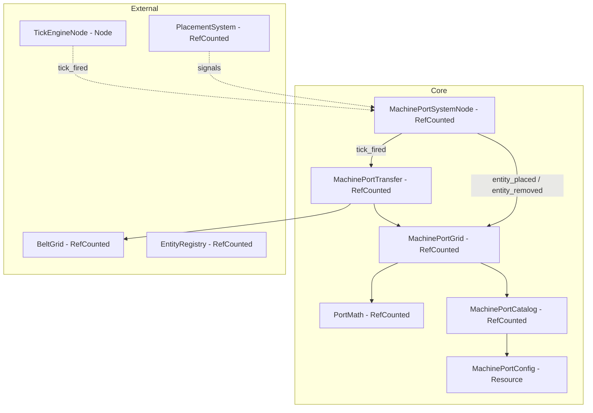
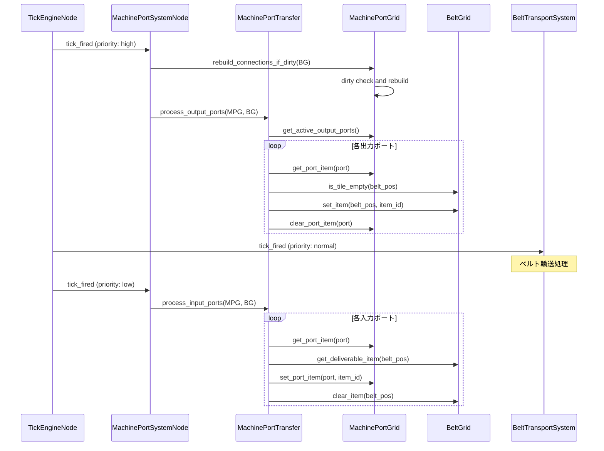
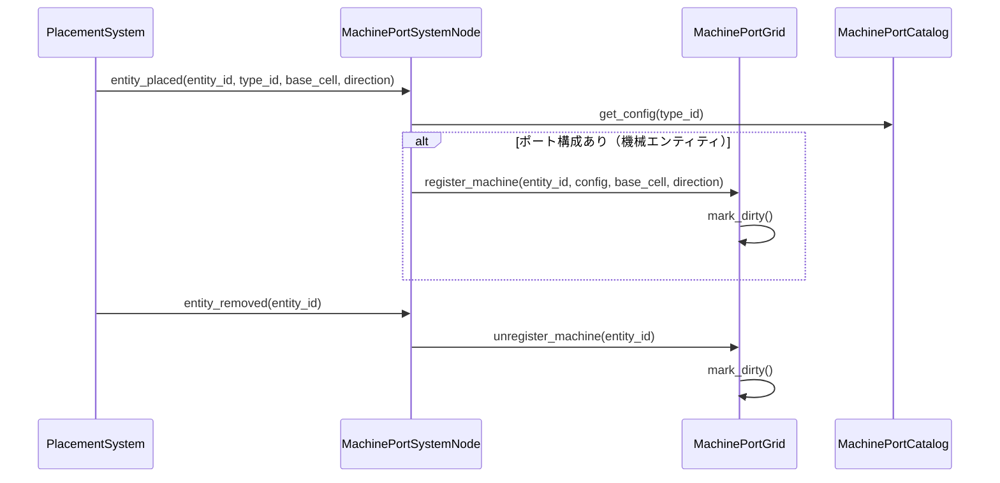
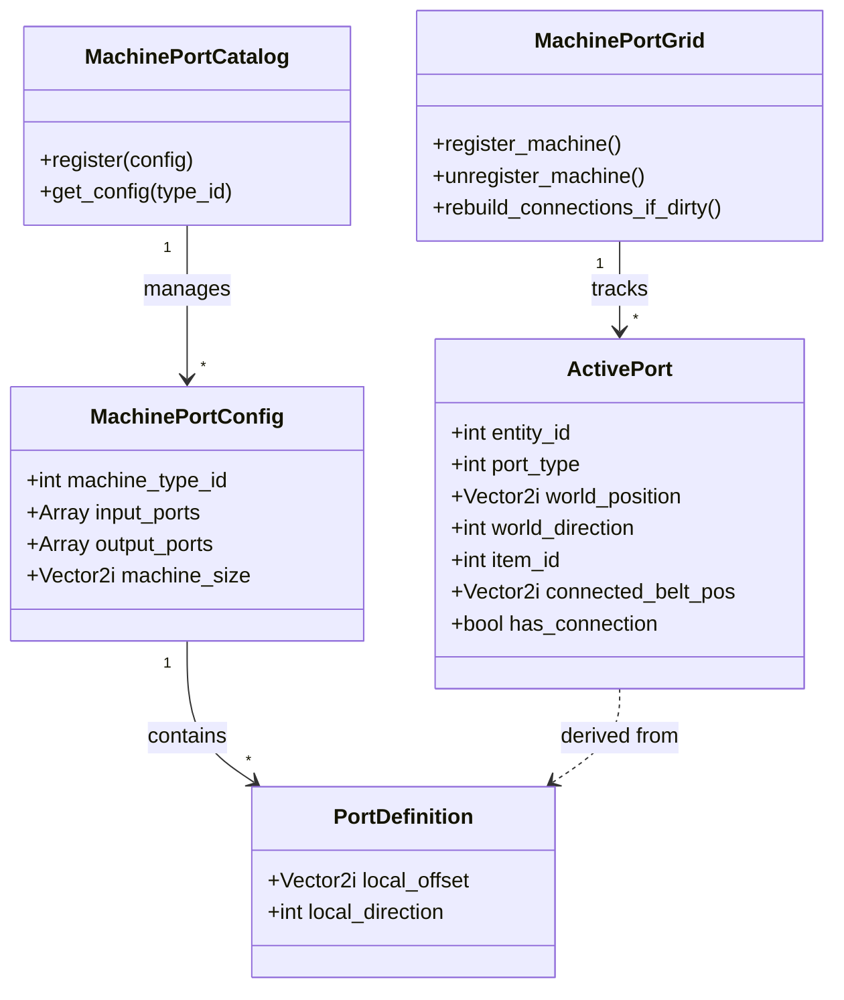

# Design Document: Machine Port System

## Overview

**Purpose**: 全機械タイプ（採掘機・精錬機・納品箱）に共通の入出力ポート仕様を提供し、隣接ベルトとのアイテム自動受け渡しを実現する。
**Users**: 工場レイアウトを構築するプレイヤーが、機械とベルトを隣接配置するだけでアイテムフローを構築する。
**Impact**: 既存の BeltGrid / PlacementSystem に対して、ポート接続解決とアイテム転送のレイヤーを追加する。

### Goals
- 機械タイプごとのポート構成（位置・方向・タイプ）を定義データとして管理する
- 4方向回転に対応した正確なポート位置計算を提供する
- 隣接ベルトとの空間的接続解決を自動化する
- 出力ポート→ベルト、ベルト→入力ポートのアイテム転送を毎ティック実行する
- バックプレッシャーとアイテム保存則を保証する

### Non-Goals
- 個別機械の内部処理ロジック（採掘、精錬、納品カウント）
- 複数入力/出力ポートを持つ機械のサポート（MVPでは各1つまで）
- ポートフィルタリング（特定アイテムのみ受け入れ）
- ベルト以外の輸送手段との接続
- ポート接続の視覚的インジケーター

## Architecture

### Architecture Pattern & Boundary Map

既存のデータ指向ハイブリッドアーキテクチャに準拠する。コアロジックは RefCounted 層、ティック駆動は Node 層で薄くブリッジする。



**Architecture Integration**:
- Selected pattern: データ指向ハイブリッド（全コンポーネントが RefCounted/Resource）。MachinePortSystemNode も RefCounted として実装し、BeltTransportSystem と同様に実際のシーン統合はラッパー Node が担うパターンに準拠
- Domain boundaries: ポート定義・接続管理・転送ロジックを MachinePortSystem ドメインに集約。BeltGrid / PlacementSystem とは契約ベースで連携
- Existing patterns preserved: EntityDefinition/EntityRegistry カタログパターン、BeltGrid の dirty-flag 遅延再構築パターン
- Steering compliance: コアロジックの SceneTree 非依存、単方向データフロー

### Technology Stack

| Layer | Choice / Version | Role in Feature | Notes |
|-------|------------------|-----------------|-------|
| Core Logic | GDScript RefCounted | ポート定義、回転計算、接続管理、転送ロジック | SceneTree 非依存、L1テスト可能 |
| Data Definition | GDScript Resource | 機械タイプごとのポート構成データ | MachinePortConfig として定義 |
| System Adapter | GDScript RefCounted | ティック処理・イベントブリッジのコアロジック（シグナル接続は factory_placement.gd が担当） | MachinePortSystemNode |
| Events | Godot Signals | 配置/撤去通知、ティック通知 | プレゼンテーション↔ロジック間のみ |

## System Flows

### ティック処理シーケンス



**Key Decisions**:
- ティック内処理順序: Output ports → Belt transport → Input ports（research.md 参照）
- 出力を先に処理することで同一ティック内での最大スループットを実現
- MachinePortSystemNode は tick_fired を2回（高優先度: 出力、低優先度: 入力）受信するか、単一ハンドラ内で BeltTransportSystem の前後に分割実行

### 配置/撤去時の接続更新フロー



## Requirements Traceability

| Requirement | Summary | Components | Interfaces | Flows |
|-------------|---------|------------|------------|-------|
| 1.1-1.5 | ポート定義と回転 | MachinePortConfig, MachinePortCatalog, PortMath | get_config(), rotate_offset(), rotate_direction() | 配置時フロー |
| 2.1-2.4 | ポート接続解決 | MachinePortGrid, PortMath | rebuild_connections(), resolve_connection() | 接続更新フロー |
| 3.1-3.4 | 出力ポート転送 | MachinePortTransfer, MachinePortGrid | process_output_ports() | ティック処理（出力） |
| 4.1-4.4 | 入力ポート引き込み | MachinePortTransfer, MachinePortGrid | process_input_ports() | ティック処理（入力） |
| 5.1-5.5 | バックプレッシャー | MachinePortTransfer | process_output_ports(), process_input_ports() | ティック処理 |
| 6.1-6.4 | ポート接続動的更新 | MachinePortGrid, MachinePortSystemNode | register/unregister_machine(), mark_dirty() | 配置/撤去フロー |
| 7.1-7.4 | アイテム保存則 | MachinePortTransfer | 全転送メソッド | ティック処理 |
| 8.1-8.3 | E2E統合フロー | 全コンポーネント | 全インターフェース | 全フロー |

## Components and Interfaces

| Component | Domain/Layer | Intent | Req Coverage | Key Dependencies | Contracts |
|-----------|-------------|--------|--------------|-----------------|-----------|
| PortMath | Core/Utility | ポートオフセット・方向の回転計算 | 1.3, 1.4 | なし | Service |
| MachinePortConfig | Core/Data | 機械タイプごとのポート定義データ | 1.1, 1.2, 1.5 | なし | State |
| MachinePortCatalog | Core/Registry | ポート構成のカタログ管理 | 1.1, 1.2 | MachinePortConfig | Service |
| MachinePortGrid | Core/State | アクティブポートの状態・接続管理 | 2.1-2.4, 6.1-6.4 | PortMath, MachinePortCatalog, BeltGrid (P0) | Service, State |
| MachinePortTransfer | Core/Logic | 毎ティックのポート-ベルト間アイテム転送 | 3.1-3.4, 4.1-4.4, 5.1-5.5, 7.1-7.4 | MachinePortGrid (P0), BeltGrid (P0) | Service |
| MachinePortSystemNode | Systems/Adapter | ティック・配置イベントのコアロジックブリッジ（RefCounted、シーン統合は factory_placement.gd） | 6.1-6.4, 8.1-8.3 | MachinePortGrid (P0), MachinePortTransfer (P0), BeltGrid (P0) | Service |

### Core / Utility

#### PortMath

| Field | Detail |
|-------|--------|
| Intent | ポートオフセット・方向の回転計算（純粋関数群） |
| Requirements | 1.3, 1.4 |

**Responsibilities & Constraints**
- ポートの相対オフセットを機械の回転方向に応じてワールド座標に変換する
- ポートの向きを機械の回転方向に応じて変換する
- 純粋関数のみ、状態を持たない
- 正方形グリッド（2x2）と非正方形に対応する汎用回転公式

**Dependencies**
- なし（完全独立）

**Contracts**: Service [x]

##### Service Interface
```gdscript
class_name PortMath
extends RefCounted

## 相対オフセットを機械の回転方向に応じて回転する
## offset: 北基準の相対オフセット（base_cellからの差分）
## machine_size: 機械のフットプリントサイズ（Vector2i）
## direction: 機械の向き（Direction enum: N=0, E=1, S=2, W=3）
## Returns: 回転後のオフセット
static func rotate_offset(offset: Vector2i, machine_size: Vector2i, direction: int) -> Vector2i:
    pass

## ポート方向を機械の回転方向に応じて回転する
## port_direction: 北基準のポート方向（Direction enum）
## machine_direction: 機械の向き（Direction enum）
## Returns: 回転後の方向
static func rotate_direction(port_direction: int, machine_direction: int) -> int:
    pass

## ポートの接続先ベルト位置を計算する
## port_world_pos: ポートのワールド座標
## port_world_dir: ポートのワールド方向
## Returns: 接続先のベルト位置
static func get_connected_position(port_world_pos: Vector2i, port_world_dir: int) -> Vector2i:
    pass

## 方向を単位ベクトルに変換する
static func direction_to_vector(direction: int) -> Vector2i:
    pass
```
- Preconditions: direction は 0-3 の範囲内、offset は machine_size 範囲内
- Postconditions: 回転結果は machine_size 範囲内に収まる
- Invariants: 4回同方向に回転すると元に戻る

**Implementation Notes**
- 回転公式: N→そのまま、E→(size_y-1-y, x)、S→(size_x-1-x, size_y-1-y)、W→(y, size_x-1-x)
- direction_to_vector: N→(0,-1)、E→(1,0)、S→(0,1)、W→(-1,0)（Godot Y軸下向き）

### Core / Data

#### MachinePortConfig

| Field | Detail |
|-------|--------|
| Intent | 機械タイプごとのポート構成データ定義 |
| Requirements | 1.1, 1.2, 1.5 |

**Responsibilities & Constraints**
- 機械タイプに紐づく入力/出力ポートの北基準定義を保持する
- イミュータブル — 実行時に変更しない
- 各ポートは local_offset（Vector2i）と local_direction（int）を持つ

**Contracts**: State [x]

##### State Management
```gdscript
class_name MachinePortConfig
extends Resource

## ポート1つ分の定義（内部データクラス）
## GDScriptではinner classまたはDictionaryで表現
## port_type: int (0=INPUT, 1=OUTPUT)
## local_offset: Vector2i (北基準、base_cellからの相対位置)
## local_direction: int (北基準、Direction enum)

var machine_type_id: int  ## EntityDefinition.entity_type_id と対応
var input_ports: Array  ## Array of {local_offset: Vector2i, local_direction: int}
var output_ports: Array  ## Array of {local_offset: Vector2i, local_direction: int}
var machine_size: Vector2i  ## フットプリントサイズ（回転計算に必要）
```

**MVP Port Configurations（北基準）**:

| Machine | Type ID | Size | Input Ports | Output Ports |
|---------|---------|------|-------------|--------------|
| Miner | 1 | 2x2 | なし | offset=(1,1), dir=S |
| Smelter | 2 | 2x2 | offset=(0,0), dir=N | offset=(1,1), dir=S |
| DeliveryBox | 4 | 1x1 | offset=(0,0), dir=N | なし |

**Implementation Notes**
- ポート位置はゲームデザインの調整対象。上記はデフォルト値であり、MachinePortCatalog.create_default() で変更可能

### Core / Registry

#### MachinePortCatalog

| Field | Detail |
|-------|--------|
| Intent | MachinePortConfig のカタログ管理 |
| Requirements | 1.1, 1.2 |

**Responsibilities & Constraints**
- machine_type_id → MachinePortConfig のマッピングを管理する
- 非機械エンティティ（Belt等）は登録しない
- create_default() で MVP 機械のポート構成を一括登録する

**Dependencies**
- Inbound: MachinePortGrid — ポート構成の取得 (P0)
- Outbound: MachinePortConfig — データ保持 (P0)

**Contracts**: Service [x]

##### Service Interface
```gdscript
class_name MachinePortCatalog
extends RefCounted

var _configs: Dictionary  ## {int: MachinePortConfig}

func register(config: MachinePortConfig) -> void:
    pass

func get_config(machine_type_id: int) -> MachinePortConfig:
    pass  ## Returns null if not a machine type

func has_config(machine_type_id: int) -> bool:
    pass

static func create_default() -> MachinePortCatalog:
    pass  ## MVP 3機械を登録
```

### Core / State

#### MachinePortGrid

| Field | Detail |
|-------|--------|
| Intent | アクティブポートのランタイム状態と接続関係の管理 |
| Requirements | 2.1-2.4, 6.1-6.4 |

**Responsibilities & Constraints**
- 配置済み機械のポートインスタンス（ワールド座標・方向・バッファ）を管理する
- dirty-flag による遅延接続再構築（配置/撤去時にフラグセット、次ティックで再構築）
- ポートバッファは1アイテム最大（item_id: int, 0=空）
- 機械撤去時はポートを即座に削除し、バッファ内アイテムは消失（要件7.4のスコープ外注記に準拠）

**Dependencies**
- Inbound: MachinePortTransfer — ポート状態の読み書き (P0)
- Inbound: MachinePortSystemNode — 配置/撤去イベントの受信 (P0)
- Outbound: PortMath — 回転計算 (P0)
- Outbound: MachinePortCatalog — ポート構成の取得 (P0)
- Outbound: BeltGrid — 接続先ベルトの存在確認 (P0)

**Contracts**: Service [x] / State [x]

##### Service Interface
```gdscript
class_name MachinePortGrid
extends RefCounted

## --- 機械の登録/解除 ---

## 機械を登録し、ポートインスタンスを生成する
func register_machine(entity_id: int, machine_type_id: int,
        base_cell: Vector2i, direction: int) -> void:
    pass

## 機械を解除し、ポートインスタンスを削除する（バッファ内アイテムは消失）
func unregister_machine(entity_id: int) -> void:
    pass

## --- 接続管理 ---

## dirty flag をセットする
func mark_dirty() -> void:
    pass

## dirty なら接続関係を再構築する
func rebuild_connections_if_dirty(belt_grid: BeltGrid) -> void:
    pass

## --- ポート状態アクセス ---

## アクティブな出力ポート一覧を取得する
func get_active_output_ports() -> Array:
    pass  ## Array of ActivePort

## アクティブな入力ポート一覧を取得する
func get_active_input_ports() -> Array:
    pass  ## Array of ActivePort

## ポートのバッファアイテムを取得する（0=空）
func get_port_item(port_index: int) -> int:
    pass

## ポートのバッファにアイテムをセットする
func set_port_item(port_index: int, item_id: int) -> void:
    pass

## ポートのバッファをクリアする
func clear_port_item(port_index: int) -> void:
    pass
```
- Preconditions: register_machine の entity_id は一意、machine_type_id は MachinePortCatalog に登録済み
- Postconditions: unregister_machine 後、そのエンティティのポートは一切参照不可
- Invariants: 各ポートのバッファは常に 0 または有効な item_id

##### State Management
```gdscript
## ActivePort — ランタイムポートインスタンスの内部表現
## entity_id: int
## port_type: int (0=INPUT, 1=OUTPUT)
## world_position: Vector2i (base_cell + rotated offset)
## world_direction: int (rotated direction)
## item_id: int (buffer, 0=empty)
## connected_belt_pos: Vector2i (resolved, Vector2i(-1,-1) if none)
## has_connection: bool
```

**Implementation Notes**
- 接続解決ロジック: ポートのワールド位置 + ワールド方向からベルト位置を計算し、BeltGrid にベルトが存在するか確認。出力ポートはベルトの存在のみチェック。入力ポートはベルトの存在に加え、ベルトの downstream がポート方向を向いているかをチェック
- ベルト配置/撤去時にも mark_dirty() が必要 — MachinePortSystemNode が PlacementSystem のシグナルを監視してベルト entity_type_id=3 の変更もキャッチする

### Core / Logic

#### MachinePortTransfer

| Field | Detail |
|-------|--------|
| Intent | 毎ティックの出力ポート→ベルト・ベルト→入力ポートのアイテム転送 |
| Requirements | 3.1-3.4, 4.1-4.4, 5.1-5.5, 7.1-7.4 |

**Responsibilities & Constraints**
- 出力ポート処理: バッファにアイテムがあり、接続先ベルトが空なら転送
- 入力ポート処理: バッファが空で、接続先ベルトに到達済みアイテムがあれば引き込み
- アイテム保存則: 転送は常にアトミック（1個除去 → 1個追加）
- バックプレッシャー: 条件不成立時はスキップ（アクティブな制御は不要、毎ティックのチェックで自然に実現）

**Dependencies**
- Outbound: MachinePortGrid — ポート状態の読み書き (P0)
- Outbound: BeltGrid — ベルトへのアイテム配置/取得 (P0)

**Contracts**: Service [x]

##### Service Interface
```gdscript
class_name MachinePortTransfer
extends RefCounted

## 全出力ポートを処理する（Output → Belt）
## Returns: 転送されたアイテム数
func process_output_ports(port_grid: MachinePortGrid, belt_grid: BeltGrid) -> int:
    pass

## 全入力ポートを処理する（Belt → Input）
## Returns: 引き込まれたアイテム数
func process_input_ports(port_grid: MachinePortGrid, belt_grid: BeltGrid) -> int:
    pass
```
- Preconditions: port_grid の接続が最新（rebuild_connections_if_dirty 済み）
- Postconditions: 転送前後でシステム全体のアイテム総数が保存される
- Invariants: 1回の転送で移動するアイテムは正確に1個

### Core / Adapter

#### MachinePortSystemNode

| Field | Detail |
|-------|--------|
| Intent | ティック処理と配置/撤去イベントをコアロジックにブリッジする薄いアダプター |
| Requirements | 6.1-6.4, 8.1-8.3 |

**Responsibilities & Constraints**
- `tick_output()` で接続再構築 + 出力ポート→ベルト転送を実行する
- `tick_input()` でベルト→入力ポート引き込みを実行する
- `on_entity_placed()` / `on_entity_removed()` で機械登録/解除またはdirty flagセットを実行する
- コアロジックを一切持たない（委譲のみ）
- **RefCounted として実装**（BeltTransportSystem と同様のパターン）。実際のシーンへの統合はラッパーNodeが担う
- Belt(type_id=3) はポート登録対象外の非機械エンティティとして識別

**Dependencies**
- Outbound: MachinePortGrid — 機械の登録/解除、接続再構築 (P0)
- Outbound: MachinePortTransfer — ティック処理 (P0)
- Outbound: BeltGrid — 接続再構築・転送用 (P0)

**Contracts**: Service [x]

##### Service Interface
```gdscript
class_name MachinePortSystemNode
extends RefCounted

const BELT_ENTITY_TYPE_ID: int = 3

## 出力転送ティック処理（接続再構築 + 出力ポート → ベルト）
func tick_output() -> void:
    pass

## 入力転送ティック処理（ベルト → 入力ポート）
func tick_input() -> void:
    pass

## エンティティ配置通知を受け取り、機械なら登録・ベルトならdirtyをセット
func on_entity_placed(entity_id: int, base_cell: Vector2i, direction: int, entity_type_id: int) -> void:
    pass

## エンティティ撤去通知を受け取り、機械なら解除・ベルトならdirtyをセット
func on_entity_removed(entity_id: int, base_cell: Vector2i, entity_type_id: int) -> void:
    pass
```
- Preconditions: コンストラクタで MachinePortGrid, BeltGrid, MachinePortTransfer を注入済み
- Postconditions: tick_output/tick_input は MachinePortGrid/MachinePortTransfer に委譲するのみ
- Ordering: tick_output → Belt transport → tick_input の順で呼び出されること

## Data Models

### Domain Model



**Business Rules & Invariants**:
- 各ポートバッファは最大1アイテム（item_id > 0 なら満杯、== 0 なら空）
- 接続は空間的隣接 + 方向互換性で決定（明示的リンク不要）
- 機械撤去時、そのポートのバッファアイテムは消失する（MVPスコープ）

### Logical Data Model

**ActivePort 属性**:

| Attribute | Type | Description | Constraint |
|-----------|------|-------------|------------|
| entity_id | int | 所属する機械のエンティティID | > 0 |
| port_type | int | INPUT=0, OUTPUT=1 | 0 or 1 |
| world_position | Vector2i | ポートのワールドグリッド座標 | グリッド範囲内 |
| world_direction | int | ポートのワールド方向 | 0-3 (N/E/S/W) |
| item_id | int | バッファ内アイテムID | 0=空, >0=有効アイテム |
| connected_belt_pos | Vector2i | 接続先ベルトのグリッド座標 | Vector2i(-1,-1)=未接続 |
| has_connection | bool | 接続済みフラグ | connected_belt_pos と同期 |

## Error Handling

### Error Strategy
ポートシステムは内部シミュレーションのため、ユーザー向けエラーは発生しない。エラーは静かに無視し、アイテム保存則を最優先で守る。

### Error Categories and Responses

| Scenario | Response | Item Conservation |
|----------|----------|-------------------|
| 接続先ベルトが満杯 | 転送スキップ、アイテムをポートバッファに保持 | 保存 |
| 接続先ベルトなし | 転送スキップ、アイテムをポートバッファに保持 | 保存 |
| 入力ポート満杯 | 引き込みスキップ | 保存 |
| 接続先にベルトアイテムなし | 引き込みスキップ | 保存 |
| 未登録の machine_type_id | register_machine で無視（ログ出力） | N/A |
| 重複 entity_id の登録 | 既存を上書き（警告ログ） | 既存バッファは消失 |

## Testing Strategy

### Layer 1: Unit Tests (Pure Logic)

テスト対象（すべて SceneTree 非依存）:

1. **PortMath 回転テスト**:
   - 全4方向 × 各オフセットで正しい回転結果を検証
   - 4回同方向回転で元に戻ることを検証
   - direction_to_vector の正確性

2. **MachinePortCatalog テスト**:
   - create_default() で MVP 3機械が正しく登録される
   - get_config() で正しい構成が返る
   - 未登録 type_id で null が返る

3. **MachinePortGrid 登録/解除テスト**:
   - register_machine でポートが正しいワールド座標に生成される
   - unregister_machine でポートが完全に削除される
   - 全4方向で正しいワールド座標が計算される

4. **MachinePortGrid 接続解決テスト**:
   - 隣接ベルトが存在する場合に接続成立
   - 隣接ベルトが存在しない場合に接続不成立
   - 方向不一致の場合に接続不成立（入力ポート）
   - dirty flag が適切にセット/クリアされる

5. **MachinePortTransfer 転送テスト**:
   - 出力ポート: バッファ有 + ベルト空 → 転送成功、バッファクリア
   - 出力ポート: バッファ有 + ベルト満 → 転送スキップ、バッファ維持
   - 入力ポート: バッファ空 + ベルトにアイテム → 引き込み成功
   - 入力ポート: バッファ満 → 引き込みスキップ
   - アイテム保存則: 転送前後のアイテム総数一致

6. **バックプレッシャーテスト**:
   - 出力先満杯時に出力停止、空き発生時に再開
   - 入力ポート満杯時に引き込み停止、消費後に再開
   - バックプレッシャー中のアイテム消失なし

### Layer 2: Integration Tests (Constraint Verification)

1. **E2E統合フロー**: 出力ポート付き機械 → ベルト5本 → 入力ポート付き機械のアイテム到達検証
2. **全4方向回転での転送動作**: 各方向でベルトへの転送が正常に機能
3. **配置/撤去後の接続更新**: 動的なレイアウト変更でポート接続が正しく再評価される
4. **アイテム保存則E2E**: 100アイテム投入 → 100アイテム受取（誤差0）

#### Non-Testable Aspects
- ティック処理タイミングによる微小な転送遅延の変動
- レビュー方法: CI 環境でのベルト5本介在フローテスト
- 受け入れ閾値: 投入数 = 受取数（完全一致）

### Layer 4: Human Review

1. **ポート位置の直感性**: 機械のポート位置がプレイヤーにとって直感的に理解できるか
   - レビュー方法: ゲーム実行中に各機械を配置し、ベルトとの接続位置を目視確認
   - 受け入れ閾値: ポートの位置と方向がアートワーク/UIで視覚的に示唆されていること

## Implementation Changelog

_Records deviations discovered during implementation that caused updates to this design document._

| Date | Category | Change | Reason |
|------|----------|--------|--------|
| 2026-03-15 | [ARCHITECTURE] | MachinePortSystemNode を Node → RefCounted に変更。Architecture図、Technology Stack、Components表、Service Interfaceを更新 | BeltTransportSystemと同一パターンに統一。シグナル接続はfactory_placement.gd（Node）が担当し、テスト可能性を向上 |
