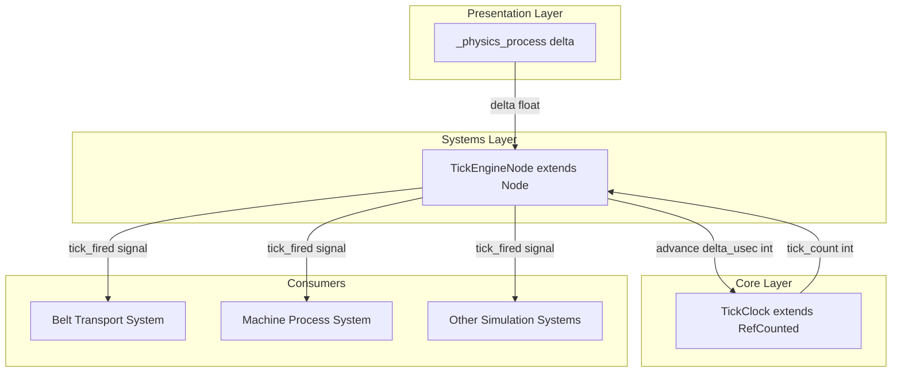
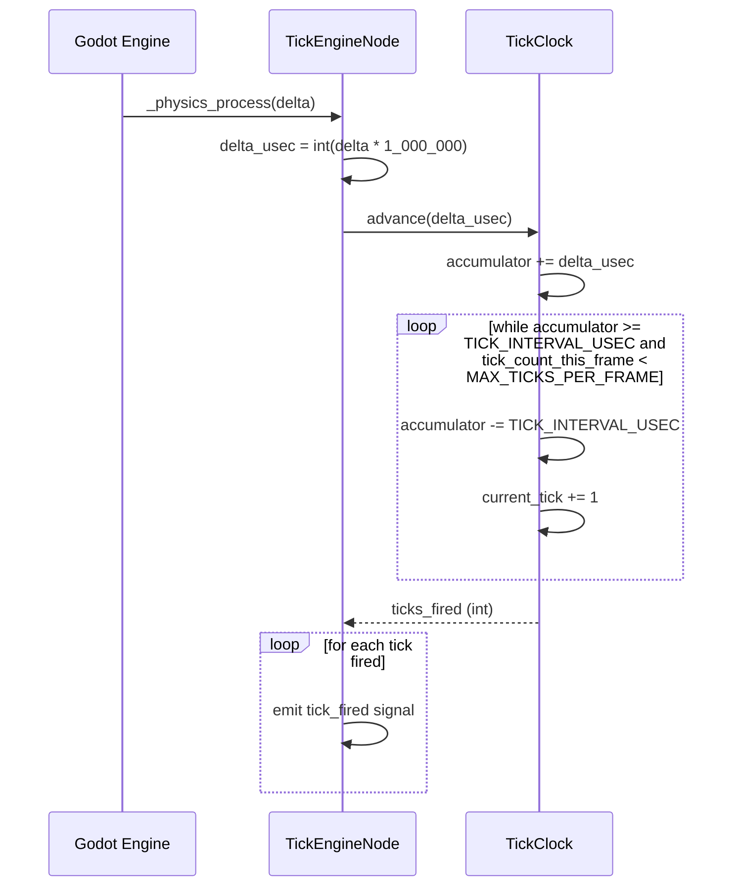
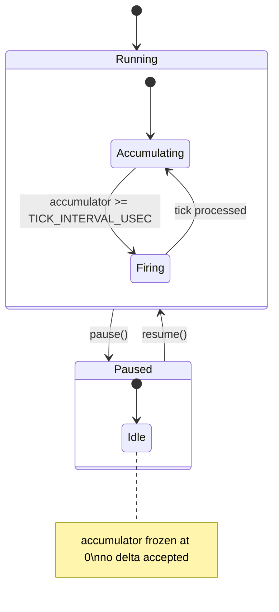
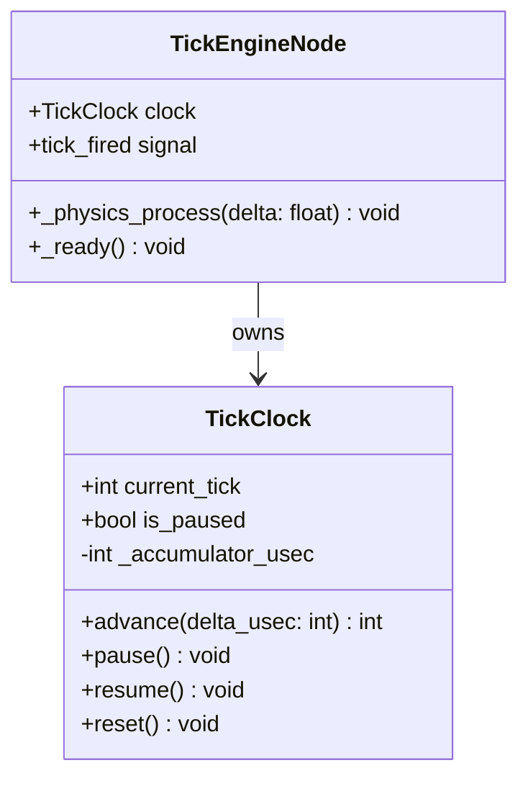

# Design Document: Tick Engine

## Overview

**Purpose**: Tick Engineは、ファクトリーオートメーションゲームのシミュレーション時間進行を管理する固定レートティックシステムを提供する。フレームレートに依存しない一定間隔（60tps = 16.67ms）でシミュレーションを更新し、全ての時間依存シミュレーション動作の基盤となる。

**Users**: シミュレーション開発者がティック発火タイミングとティックカウントを参照してベルト輸送・機械加工・資源フロー等の時間依存ロジックを実装する。プレイヤーはフレームレートに左右されない安定したシミュレーション体験を得る。

**Impact**: 新規機能（グリーンフィールド）。既存システムへの変更なし。

### Goals
- 60tps固定レートでの決定的なティック発火
- SceneTree非依存のコアロジックによる完全なL1テスト可能性
- マイクロ秒整数演算による浮動小数点累積誤差の排除
- スパイラルオブデス防止のためのキャッチアップ制限
- 一時停止/再開機能

### Non-Goals
- ティックレートの動的変更（早送り・スロー機能）
- ネットワーク同期・ロックステップ
- ティック履歴の記録・リプレイ
- 個別の時間依存シミュレーション動作の実行順序定義
- 一時停止/再開のUI・キーバインド

## Architecture

### Architecture Pattern & Boundary Map



**Architecture Integration**:
- **Selected pattern**: 純粋RefCounted + Nodeアダプターの2層構成。コアロジックをSceneTree非依存にすることでL1テスト可能性と決定性を確保する
- **Domain/feature boundaries**: TickClock（core層）がティック計算の全責任を持ち、TickEngineNode（systems層）はGodotとのブリッジのみを担当
- **Existing patterns preserved**: structure.mdの「コアロジックはextends RefCounted」「ロジック ≠ プレゼンテーション」原則に準拠
- **New components rationale**: TickClock — ティック計算の純粋ロジック。TickEngineNode — Godotフレームループとの接続点
- **Steering compliance**: tech.mdの「ゲームロジックはSceneTree/Node APIに依存しない純粋なデータ＋システム」「`_physics_process`でシミュレーション更新」に合致

### Technology Stack

| Layer | Choice / Version | Role in Feature | Notes |
|-------|------------------|-----------------|-------|
| Simulation / Core Logic | GDScript, extends RefCounted | TickClock: ティック計算の純粋ロジック | SceneTree非依存、L1テスト対象 |
| Systems | GDScript, extends Node | TickEngineNode: Godotフレームループとのブリッジ | `_physics_process`でdeltaを受信 |
| Events / Messaging | Godot Signals | ティック発火の通知 | tech.mdのシグナル使用範囲に準拠 |
| Infrastructure / Runtime | Godot 4.3+ | エンジンランタイム | `physics/common/physics_ticks_per_second` = 60 |

## System Flows

### ティック発火フロー（通常時）



**Key Decisions**:
- delta→μs変換はTickEngineNode（入口）で1回のみ実施。TickClockはμs整数のみ扱う
- キャッチアップ上限（5回）到達時はaccumulatorを0にリセットし、超過分を完全破棄

### 一時停止/再開フロー



**Key Decisions**:
- pause()時はaccumulatorをクリアしない（既に蓄積済みの端数は保持不要 — resume()でリセットする）
- resume()時にaccumulatorを0にリセットすることで、停止期間中の時間蓄積による大量キャッチアップを防止

## Requirements Traceability

| Requirement | Summary | Components | Interfaces | Flows |
|-------------|---------|------------|------------|-------|
| 1.1, 1.2, 1.3, 1.4 | 固定レートティック発火 | TickClock | advance(), TICK_INTERVAL_USEC | ティック発火フロー |
| 2.1, 2.2, 2.3, 2.4 | ティックカウント管理 | TickClock | current_tick, advance() | ティック発火フロー |
| 3.1, 3.2, 3.3 | キャッチアップ制限 | TickClock | MAX_TICKS_PER_FRAME, advance() | ティック発火フロー |
| 4.1, 4.2, 4.3, 4.4, 4.5 | 一時停止と再開 | TickClock | pause(), resume(), is_paused | 一時停止/再開フロー |
| 5.1, 5.2, 5.3, 5.4 | フレームレート非依存性 | TickClock, TickEngineNode | advance() | ティック発火フロー |
| 6.1, 6.2, 6.3 | ティック非発火フレームの振る舞い | TickClock, TickEngineNode | advance(), tick_fired | ティック発火フロー |
| 7.1, 7.2, 7.3 | 決定性の保証 | TickClock | 整数演算、固定更新順序 | ティック発火フロー |
| 8.1, 8.2 | 高負荷時の安定性 | TickClock | MAX_TICKS_PER_FRAME | ティック発火フロー |

## Components and Interfaces

| Component | Domain/Layer | Intent | Req Coverage | Key Dependencies | Contracts |
|-----------|-------------|--------|--------------|------------------|-----------|
| TickClock | Core | ティック発火計算の純粋ロジック | 1, 2, 3, 4, 5, 6, 7, 8 | なし | Service, State |
| TickEngineNode | Systems | Godotフレームループとのブリッジ | 5, 6 | TickClock (P0) | Service, Event |

### Core Layer

#### TickClock

| Field | Detail |
|-------|--------|
| Intent | deltaTime（μs整数）を受け取り、固定間隔でティックを発火し、ティックカウントを管理する純粋ロジッククラス |
| Requirements | 1.1, 1.2, 1.3, 1.4, 2.1, 2.2, 2.3, 2.4, 3.1, 3.2, 3.3, 4.1, 4.2, 4.3, 4.4, 4.5, 5.1, 5.2, 5.3, 5.4, 6.1, 7.1, 7.2, 7.3, 8.1, 8.2 |

**Responsibilities & Constraints**
- マイクロ秒単位の蓄積時間管理とティック発火判定
- 単調増加するティックカウントの維持
- キャッチアップ制限（最大5ティック/フレーム）の適用
- 一時停止/再開状態の管理
- SceneTree/Node APIへの依存禁止（extends RefCounted）

**Dependencies**
- Inbound: なし（純粋ロジック）
- Outbound: なし
- External: なし

**Contracts**: Service [x] / State [x]

##### Service Interface

```gdscript
class_name TickClock
extends RefCounted

# 定数
const TICK_INTERVAL_USEC: int = 16667  # 1/60秒 = 16667μs
const MAX_TICKS_PER_FRAME: int = 5

# 公開プロパティ（読み取り専用）
var current_tick: int  # 現在のティックカウント（単調増加、初期値0）
var is_paused: bool    # 一時停止状態

# コアメソッド
func advance(delta_usec: int) -> int
    ## 蓄積時間にdelta_usecを加算し、発火したティック数を返す
    ## Preconditions: delta_usec >= 0
    ## Postconditions:
    ##   - 戻り値は0以上MAX_TICKS_PER_FRAME以下
    ##   - current_tickは戻り値の分だけ増加
    ##   - is_paused == trueの場合、戻り値は常に0

func pause() -> void
    ## シミュレーションを一時停止する
    ## Postconditions: is_paused == true

func resume() -> void
    ## シミュレーションを再開する
    ## Postconditions: is_paused == false, accumulator == 0

func reset() -> void
    ## 全状態を初期値にリセットする
    ## Postconditions: current_tick == 0, accumulator == 0, is_paused == false
```

- Preconditions: advance()のdelta_usecは非負整数
- Postconditions: advance()の戻り値は[0, MAX_TICKS_PER_FRAME]の範囲。current_tickは戻り値分だけ正確に増加
- Invariants: current_tickは単調増加（reset()を除く）。accumulatorは常に非負

##### State Management

- **State model**: accumulator（int、μs単位の蓄積時間）、current_tick（int、ティックカウント）、is_paused（bool）
- **Persistence & consistency**: 蓄積時間とティックカウントは整数演算のみで更新。浮動小数点演算を使用しない
- **Concurrency strategy**: シングルスレッド前提（Godotのメインスレッド）。同期機構不要

**Implementation Notes**
- Integration: `godot/scripts/core/tick_clock.gd`に配置。structure.mdの`scripts/core/`パターンに準拠
- Validation: advance()でdelta_usec < 0の場合はassertで検出（デバッグビルド）
- Risks: deltaTime→μs変換の丸め精度（呼び出し元の責任。TickClock自体は整数のみ扱う）

### Systems Layer

#### TickEngineNode

| Field | Detail |
|-------|--------|
| Intent | Godotの`_physics_process`からdeltaTimeを受け取り、TickClockに転送し、ティック発火をシグナルで通知するブリッジNode |
| Requirements | 5.1, 5.2, 5.3, 5.4, 6.2, 6.3 |

**Responsibilities & Constraints**
- `_physics_process(delta)`でGodotフレームループからdeltaを受信
- delta（float秒）→μs（int）の変換
- TickClock.advance()の呼び出しとティック発火シグナルの発行
- ティック非発火フレームではシグナルを発行しない
- プレゼンテーション層の実行を妨げない

**Dependencies**
- Inbound: Godot Engine — `_physics_process(delta)` (P0)
- Outbound: TickClock — ティック計算委譲 (P0)
- External: なし

**Contracts**: Service [x] / Event [x]

##### Service Interface

```gdscript
class_name TickEngineNode
extends Node

# 公開プロパティ（TickClockへの委譲）
var clock: TickClock  # 内部TickClockインスタンスへの参照

# Godotコールバック
func _physics_process(delta: float) -> void
    ## deltaをμsに変換し、clock.advance()を呼び出し、
    ## 発火数分だけtick_firedシグナルを発行する

func _ready() -> void
    ## TickClockインスタンスを生成・初期化する
```

##### Event Contract

- Published events:
  - `tick_fired(tick: int)` — ティックが発火するたびに発行。tickは発火時のcurrent_tick値
- Subscribed events: なし
- Ordering / delivery guarantees: 1フレーム内の複数ティック発火はtick昇順で発行。同期実行（シグナル接続先は即時呼び出し）

**Implementation Notes**
- Integration: `godot/scripts/systems/tick_engine_node.gd`に配置。structure.mdの`scripts/systems/`パターンに準拠
- Validation: delta→μs変換は`int(delta * 1_000_000)`で実施。負のdeltaは無視（Godotの仕様上発生しない）
- Risks: Godotの`_physics_process`が停止した場合のフォールバック（エンジンレベルの問題のため本機能のスコープ外）

## Data Models

### Domain Model



- **Aggregates**: TickClockが唯一のアグリゲートルート。内部状態（accumulator, current_tick, is_paused）を一貫して管理
- **Value objects**: delta_usec（int、マイクロ秒単位の経過時間）
- **Business rules & invariants**:
  - current_tickは単調増加（reset()を除く）
  - accumulatorは常に非負
  - is_paused == trueの場合、advance()はティックを発火しない
  - 1回のadvance()呼び出しで発火するティック数はMAX_TICKS_PER_FRAME以下

## Error Handling

### Error Strategy

Tick Engineは低レベルのシミュレーション基盤であり、外部入力やネットワーク通信を持たないため、エラーハンドリングは最小限に留める。

### Error Categories and Responses

**System Errors**:
- 不正なdelta_usec（負の値）→ assert失敗（デバッグビルドで検出）。リリースビルドでは0として扱う
- キャッチアップ上限到達 → 蓄積時間破棄（正常な制御フロー。エラーではない）

**Business Logic Errors**:
- pause中のadvance()呼び出し → 正常系として0を返す（エラーではない）
- resume中のresume()呼び出し → 冪等操作として処理（accumulatorリセットのみ再実行）

## Testing Strategy

### Layer 1: Unit Tests (Pure Logic)

- Framework: GdUnit4（xvfb-run CLIモード）
- Target: TickClock（RefCounted、SceneTree非依存）
- テスト対象:
  1. **固定レート発火**: 16667μs入力で1ティック発火、33334μs入力で2ティック発火
  2. **端数繰り越し**: 20000μs入力で1ティック発火、accumulator = 3333μs残存
  3. **非発火フレーム**: 10000μs入力で0ティック発火
  4. **ティックカウント増加**: advance()後のcurrent_tickが正確に発火数分増加
  5. **キャッチアップ制限**: 100000μs（100ms）入力で5ティックのみ発火
  6. **一時停止**: pause()後のadvance()で0ティック発火
  7. **再開**: resume()後のaccumulatorが0、正常にティック発火再開
  8. **決定性**: 同一のdelta_usecシーケンスで常に同一の結果

### Layer 2: Integration Tests (Constraint Verification)

- Framework: GdUnit4（xvfb-run + SceneRunner）
- Target: TickEngineNode（Node、シグナル発行）
- テスト対象:
  1. **シグナル発行**: ティック発火時にtick_firedシグナルが正しいtick値で発行される
  2. **シグナル非発行**: ティック非発火フレームでtick_firedシグナルが発行されない
  3. **delta変換精度**: float delta → μs変換の精度検証
  4. **複数ティック発火順序**: 1フレーム内の複数シグナルがtick昇順で発行される

### Layer 3: E2E Test (Screenshot + Metrics)

- 高負荷時の性能メトリクス計測（メトリクスで客観的に判定可能）
  - E2E checkpoint: ベルト500本+アイテム2000個でFPS計測。print出力でFPS値を取得しAIが閾値判定
  - Acceptance threshold: 30FPS以上を維持
- 一時停止/再開の応答時間計測（メトリクスで判定可能）
  - E2E checkpoint: pause/resume呼び出し前後でタイムスタンプを計測し応答時間をprint出力
  - Acceptance threshold: 体感遅延なし（< 100ms）

### Performance

- **TickClock.advance()の処理時間**: < 1μs（ティック1回あたり）。純粋な整数演算のため十分に高速
- **1フレームあたりの総ティック処理時間**: < 10μs（5ティック発火時）
- **メモリ使用量**: TickClockインスタンスあたり24bytes（int x 2 + bool x 1）

## Performance & Scalability

- **Target metrics**: TickClock.advance()は1ティックあたり1μs未満。ティック発火の判定と状態更新のみの整数演算のため、性能上のボトルネックにはならない
- **Scaling**: TickClockはシングルインスタンス。スケーリングの対象は各ティック消費側システム（ベルト、機械等）であり、本機能のスコープ外
- **Optimization**: マイクロ秒整数演算により浮動小数点演算のオーバーヘッドを排除
