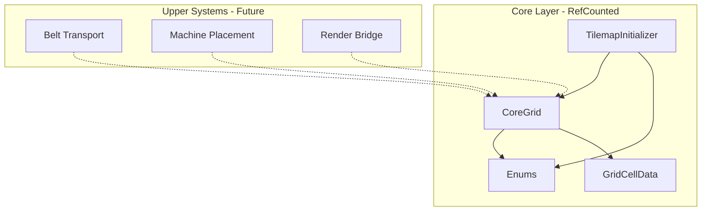
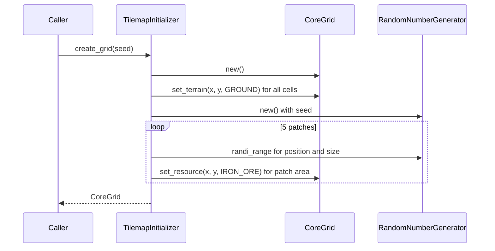
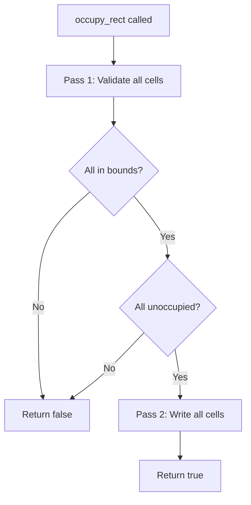
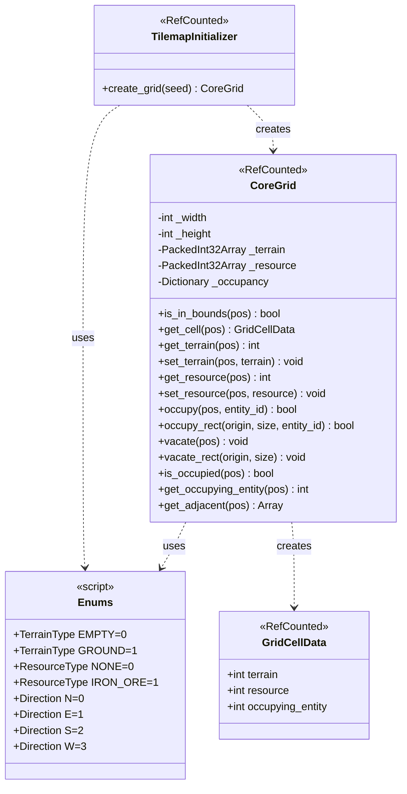

# Technical Design: tilemap-core

## Overview

**Purpose**: タイルマップ基盤は、Mad Efficiency Factoryの空間データ管理を担う最下層コンポーネントとして、64x64固定サイズの2Dグリッド上で地形・資源・占有状態を管理し、上位システムに高速な空間クエリを提供する。

**Users**: ベルト輸送システム、機械配置システム、レンダリング層など、グリッド座標を扱うすべての上位コンポーネントの開発者が利用する。

### Goals
- 64x64固定グリッドの地形・資源・占有データを効率的に管理する
- SceneTree非依存のRefCountedクラスとしてヘッドレステスト可能な設計とする
- 原子的な矩形占有操作で機械配置の整合性を保証する
- シード管理による決定的なマップ初期化を提供する

### Non-Goals
- 可変サイズグリッド（チャンクマップは将来拡張）
- TileMapLayerへのレンダリング同期（プレゼンテーション層の責務）
- シグナル/イベントの発行（シミュレーション内部は同期実行）
- セーブ/ロード機構（将来のResource snapshot機能で対応）

## Architecture

### Architecture Pattern & Boundary Map



**Architecture Integration**:
- **Selected pattern**: データ指向（密配列+疎辞書）。tech.mdのハイブリッドデータ指向方針に完全準拠。詳細な評価は`research.md`のArchitecture Pattern Evaluationを参照
- **Domain boundaries**: Core Layer内で完結。上位システムはCoreGridの公開APIのみを通じてアクセスする
- **Existing patterns preserved**: `extends RefCounted`によるSceneTree非依存、`class_name`によるグローバル参照、静的型付けアノテーション
- **New components rationale**: Enums（型統一）、GridCellData（読み取り専用スナップショット）、CoreGrid（空間データ管理）、TilemapInitializer（決定的初期化）の4コンポーネントは各々単一責務を持つ
- **Steering compliance**: structure.md（`scripts/core/`配置）、tech.md（RefCounted、決定性、シグナルなし）に準拠

### Technology Stack

| Layer | Choice / Version | Role in Feature | Notes |
|-------|------------------|-----------------|-------|
| Simulation / Core Logic | GDScript (Godot 4.3+) | 全コンポーネントの実装言語 | 静的型付けアノテーション必須 |
| Data Storage (Dense) | PackedInt32Array | 地形・資源の密グリッドデータ | ゼロ初期化がenum規約と整合 |
| Data Storage (Sparse) | Dictionary | 占有状態の疎データ | Vector2i → int マッピング |
| Randomization | RandomNumberGenerator | 決定的マップ生成 | インスタンス単位のシード管理 |
| Testing | GdUnit4 | L1ユニットテスト | ヘッドレス実行 |

## System Flows

### グリッド初期化フロー



### 矩形占有フロー（2パス原子性）



## Requirements Traceability

| Requirement | Summary | Components | Interfaces | Flows |
|-------------|---------|------------|------------|-------|
| 1.1-1.4 | グリッド生成と寸法 | CoreGrid | コンストラクタ, width, height | — |
| 2.1-2.3 | 境界チェック | CoreGrid | is_in_bounds | — |
| 3.1-3.3 | 地形データ読み書き | CoreGrid, Enums | get_terrain, set_terrain | — |
| 4.1-4.3 | 資源データ読み書き | CoreGrid, Enums | get_resource, set_resource | — |
| 5.1-5.5 | 単一セル占有管理 | CoreGrid | occupy, is_occupied, get_occupying_entity, vacate | — |
| 6.1-6.4 | 矩形占有（原子性） | CoreGrid | occupy_rect, vacate_rect | 矩形占有フロー |
| 7.1-7.2 | 隣接セルクエリ | CoreGrid | get_adjacent | — |
| 8.1-8.2 | セルデータスナップショット | CoreGrid, GridCellData | get_cell | — |
| 9.1-9.4 | 共有Enum定義 | Enums | TerrainType, ResourceType, Direction | — |
| 10.1-10.7 | グリッド初期化 | TilemapInitializer, CoreGrid, Enums | create_grid | グリッド初期化フロー |
| 11.1-11.4 | SceneTree非依存 | 全コンポーネント | extends RefCounted | — |

## Components and Interfaces

| Component | Domain/Layer | Intent | Req Coverage | Key Dependencies | Contracts |
|-----------|--------------|--------|--------------|------------------|-----------|
| Enums | Core | 共有enum定義 | 9 | なし | — |
| GridCellData | Core | セル状態の読み取り専用スナップショット | 8 | Enums (P0) | State |
| CoreGrid | Core | 64x64グリッドの空間データ管理 | 1-8, 11 | Enums (P0), GridCellData (P0) | Service, State |
| TilemapInitializer | Core | 決定的グリッド初期化 | 10, 11 | CoreGrid (P0), Enums (P0) | Service |

### Core Layer

#### Enums

| Field | Detail |
|-------|--------|
| Intent | 地形・資源・方向の共有enum定義を提供する |
| Requirements | 9.1, 9.2, 9.3, 9.4 |

**Responsibilities & Constraints**
- プロジェクト全体で使用される列挙型の単一定義元
- ゼロ値 = デフォルト/未設定の規約を厳守
- `class_name Enums`でグローバル参照可能

**Dependencies**
- なし（最下層の定義クラス）

**Contracts**: State [x]

##### State Management

```gdscript
class_name Enums
extends RefCounted

enum TerrainType { EMPTY = 0, GROUND = 1 }
enum ResourceType { NONE = 0, IRON_ORE = 1 }
enum Direction { N = 0, E = 1, S = 2, W = 3 }
```

- ゼロ値規約: EMPTY=0, NONE=0がPackedInt32Arrayのゼロ初期化と整合
- Direction は本機能では未使用だが、F4/F5（ベルト・機械）で必要となるため先行定義

#### GridCellData

| Field | Detail |
|-------|--------|
| Intent | セルの地形・資源・占有状態を保持する読み取り専用スナップショット |
| Requirements | 8.1, 8.2 |

**Responsibilities & Constraints**
- CoreGridの内部状態の読み取り専用コピーを保持
- 呼び出し側からの変更がCoreGridに波及しない設計
- GDScriptにimmutableフィールドがないため、規約ベースで読み取り専用を保証

**Dependencies**
- Inbound: CoreGrid — get_cell()の戻り値として生成 (P0)

**Contracts**: State [x]

##### State Management

```gdscript
class_name GridCellData
extends RefCounted

var terrain: int    # Enums.TerrainType
var resource: int   # Enums.ResourceType
var occupying_entity: int  # エンティティID（0 = 未占有）
```

- 生成時にコンストラクタで値を設定、以降は変更しない（規約）
- occupying_entity = 0 は未占有を表す

#### CoreGrid

| Field | Detail |
|-------|--------|
| Intent | 64x64固定グリッドの地形・資源・占有データを管理し、空間クエリを提供する |
| Requirements | 1.1-1.4, 2.1-2.3, 3.1-3.3, 4.1-4.3, 5.1-5.5, 6.1-6.4, 7.1-7.2, 8.1-8.2, 11.1 |

**Responsibilities & Constraints**
- 64x64固定サイズのグリッドデータの所有と管理
- 境界チェック付きの安全なアクセス
- 原子的な矩形占有操作の保証
- SceneTree/Node APIへの依存禁止

**Dependencies**
- Outbound: Enums — 型定義参照 (P0)
- Outbound: GridCellData — スナップショット生成 (P0)

**Contracts**: Service [x] / State [x]

##### Service Interface

```gdscript
class_name CoreGrid
extends RefCounted

# --- Properties ---
var width: int:
    get: return _width
var height: int:
    get: return _height

# --- Query Methods ---
func is_in_bounds(pos: Vector2i) -> bool
func get_terrain(pos: Vector2i) -> int        # Enums.TerrainType
func get_resource(pos: Vector2i) -> int       # Enums.ResourceType
func is_occupied(pos: Vector2i) -> bool
func get_occupying_entity(pos: Vector2i) -> int
func get_cell(pos: Vector2i) -> GridCellData
func get_adjacent(pos: Vector2i) -> Array[Vector2i]

# --- Mutation Methods ---
func set_terrain(pos: Vector2i, terrain: int) -> void
func set_resource(pos: Vector2i, resource: int) -> void
func occupy(pos: Vector2i, entity_id: int) -> bool
func occupy_rect(origin: Vector2i, size: Vector2i, entity_id: int) -> bool
func vacate(pos: Vector2i) -> void
func vacate_rect(origin: Vector2i, size: Vector2i) -> void
```

- Preconditions: posは`is_in_bounds`で検証される。範囲外の場合、getはデフォルト値返却、setは無操作
- Postconditions: occupy/occupy_rectはbool返却（true=成功、false=拒否）
- Invariants: occupy_rectは全セル検証後にのみコミット（原子性）

##### State Management

```
Internal Storage:
- _width: int = 64 (constant)
- _height: int = 64 (constant)
- _terrain: PackedInt32Array (size: 4096, zero-initialized)
- _resource: PackedInt32Array (size: 4096, zero-initialized)
- _occupancy: Dictionary (Vector2i -> int, initially empty)

Index calculation: _terrain[pos.y * _width + pos.x]
```

- 密データ（terrain, resource）: PackedInt32Array、`y * width + x`インデックス
- 疎データ（occupancy）: Dictionary、占有セルのみエントリ存在
- PackedInt32Arrayのゼロ初期化がEMPTY=0, NONE=0と自然に整合

**Implementation Notes**
- Integration: 上位システム（ベルト、機械、レンダリングブリッジ）はCoreGridインスタンスを依存注入で受け取る
- Validation: is_in_boundsによる境界チェックを全public methodの入口で実施
- Risks: GDScriptのenumはintエイリアスのため、不正な値の代入が言語レベルで防げない → テストで検証

#### TilemapInitializer

| Field | Detail |
|-------|--------|
| Intent | シード値に基づく決定的なグリッド初期化と鉄鉱石パッチの配置 |
| Requirements | 10.1-10.7, 11.3 |

**Responsibilities & Constraints**
- CoreGridの生成と地形の一括GROUND設定
- RandomNumberGeneratorによる決定的な鉄鉱石パッチ配置
- グローバル乱数関数（randi等）の使用禁止

**Dependencies**
- Outbound: CoreGrid — グリッド生成と操作 (P0)
- Outbound: Enums — TerrainType.GROUND, ResourceType.IRON_ORE参照 (P0)

**Contracts**: Service [x]

##### Service Interface

```gdscript
class_name TilemapInitializer
extends RefCounted

func create_grid(seed: int) -> CoreGrid
```

- Preconditions: seedは任意のint値
- Postconditions: 返却されるCoreGridは全セルGROUND地形、5個の鉄鉱石パッチ（各3x3〜5x5）を含む
- Invariants: 同一seedで同一結果（決定性）

**Implementation Notes**
- Integration: ゲーム開始時またはテスト時にseedを指定して呼び出す
- Validation: パッチ配置時にグリッド境界を考慮（はみ出し防止）
- Risks: パッチ同士の重複が発生しうるが、資源の上書きは許容（鉄鉱石→鉄鉱石は冪等）

## Data Models

### Domain Model



**Aggregates and Boundaries**:
- CoreGridが集約ルート。地形・資源・占有の3つの内部データストアを所有
- GridCellDataは値オブジェクト（読み取り専用スナップショット）
- Enumsは共有定数定義

**Business Rules & Invariants**:
- グリッドサイズは64x64固定（コンストラクタで確定、変更不可）
- 占有済みセルへの二重占有は不可（先着優先）
- occupy_rectは全セル検証後にのみコミット（部分占有なし）
- ゼロ値はデフォルト/未設定を表す

### Physical Data Model

密データ（PackedInt32Array、サイズ4096）:
- `_terrain[y * 64 + x]`: Enums.TerrainType値
- `_resource[y * 64 + x]`: Enums.ResourceType値

疎データ（Dictionary）:
- `_occupancy[Vector2i(x, y)]`: エンティティID（int）。キー不在 = 未占有

## Error Handling

### Error Strategy
GDScriptの例外機構が限定的であるため、防御的プログラミングと戻り値ベースのエラーハンドリングを採用する。

### Error Categories and Responses

**境界外アクセス**:
- Query methods（get_terrain, get_resource等）: デフォルト値を返却（EMPTY, NONE, false等）
- Mutation methods（set_terrain, set_resource）: 無操作（サイレント無視）
- occupy/occupy_rect: falseを返却

**占有衝突**:
- occupy: 占有済みセルへの再占有 → false返却、既存占有は保持
- occupy_rect: 1セルでも衝突 → false返却、全セル未変更（原子性）

## Testing Strategy

### Layer 1: Unit Tests (Pure Logic)

すべてのコンポーネントがRefCountedベースであり、SceneTree非依存のため全テストがL1で実行可能。

**CoreGrid テスト対象** (18ケース):
1. グリッド生成時の寸法検証（width=64, height=64）
2. 境界内/外の`is_in_bounds`判定
3. terrain get/set ラウンドトリップ
4. resource get/set ラウンドトリップ
5. 単一セル占有・検証・解除
6. 占有済みセルへの二重占有拒否
7. occupy_rect成功（全セル未占有）
8. occupy_rect原子性（部分衝突時に全セル未変更）
9. occupy_rect範囲外拒否
10. vacate_rect
11. get_adjacent（内部セル: 4隣接）
12. get_adjacent（端セル: 2-3隣接）
13. get_cell スナップショットの独立性

**TilemapInitializer テスト対象** (5ケース):
1. 生成グリッドのサイズ検証
2. 全セルGROUND地形
3. 鉄鉱石の存在確認
4. 同一seed決定性
5. 異seed差異

### Layer 2: Integration Tests
該当なし（全コンポーネントがSceneTree非依存）

### Layer 3: Human Review
該当なし（ビジュアル/UI要素なし）
