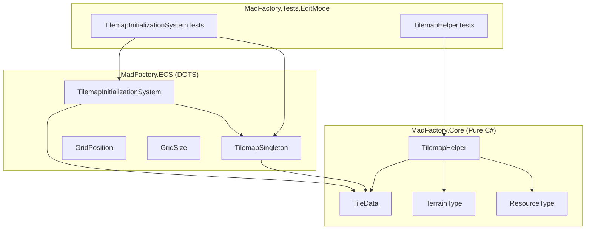
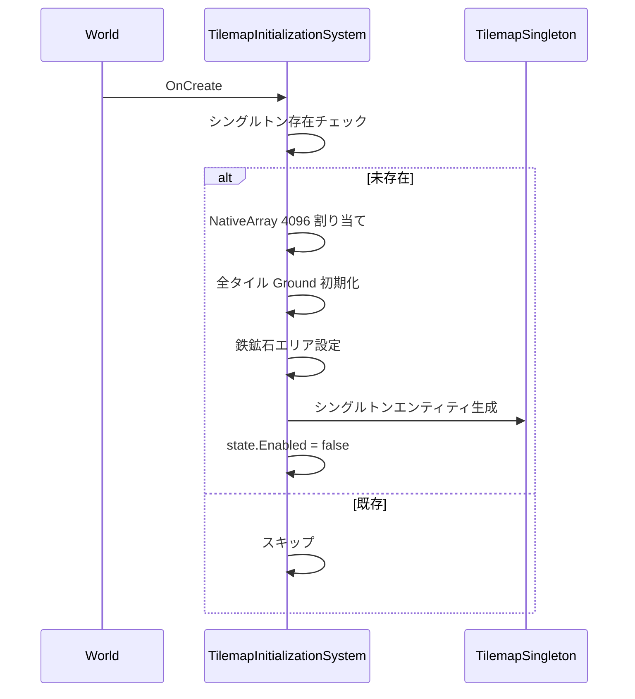
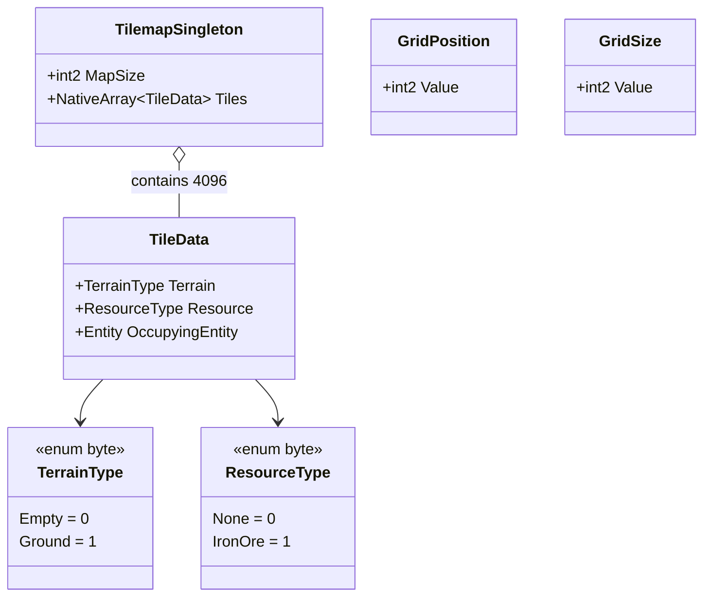

# Technical Design: tilemap-core

## Overview

**Purpose**: tilemap-core は 64x64 の 2D グリッドワールドのデータ基盤を提供する。タイルデータ管理・空間クエリ・占有追跡・鉄鉱石初期配置を実現し、全上位フィーチャーの共通基盤となる。

**Users**: 上位フィーチャー開発者（entity-placement, conveyor-belt, machine-* 等）が TilemapSingleton と TilemapHelper を通じてグリッドデータにアクセスする。

### Goals
- 64x64 タイルマップを ECS シングルトンとして効率的に管理する
- 型安全かつ Burst 互換の空間クエリ・変異 API を提供する
- 鉄鉱石の初期配置を含むタイルマップ自動初期化を実現する
- Layer 1 テストで全コアロジックを検証可能にする

### Non-Goals
- レンダリング・ビジュアル表現（rendering-bridge で対応）
- 動的マップサイズ変更・チャンクマップ（将来拡張）
- 複数資源種別の追加（item-registry で対応）
- 配置操作の UI/入力処理（entity-placement で対応）

## Architecture

### Architecture Pattern & Boundary Map



**Architecture Integration**:
- Selected pattern: ECS Singleton + 純粋ユーティリティ関数。steering 規約に完全準拠
- Domain boundaries: Core 層（TilemapHelper, データ型）と ECS 層（コンポーネント, システム）を Assembly Definition で分離
- Existing patterns preserved: ISystem + BurstCompile、Singleton パターン、POCO テスタビリティ優先
- New components rationale: Phase 0 基盤のため全て新規。上位フィーチャーの共通 API として設計
- Steering compliance: 単方向データフロー、ロジック分離、blittable 型制約を遵守

### Technology Stack

| Layer | Choice / Version | Role in Feature | Notes |
|-------|------------------|-----------------|-------|
| Simulation | Unity Entities (com.unity.entities) | ECS コンポーネント・システム基盤 | ISystem, IComponentData |
| Core Logic | Pure C# static class | タイルクエリ・変異ユーティリティ | Burst 互換、World 不要 |
| Data | NativeArray with Allocator.Persistent | タイルデータ格納 | 4096 要素固定サイズ |
| Math | Unity.Mathematics | int2 座標型 | Burst 最適化対応 |
| Compilation | Unity.Burst | 初期化システムのパフォーマンス最適化 | BurstCompile 属性 |
| Testing | Unity Test Framework (NUnit) | EditMode テスト | Layer 1 検証 |

## System Flows



初期化は OnCreate で一度だけ実行される。state.Enabled = false により OnUpdate は呼ばれない。

## Requirements Traceability

| Requirement | Summary | Components | Interfaces | Flows |
|-------------|---------|------------|------------|-------|
| 1.1-1.6 | タイルマップデータ構造 | TilemapSingleton, TileData, TerrainType, ResourceType | — | — |
| 2.1-2.4 | グリッド座標コンポーネント | GridPosition, GridSize | — | — |
| 3.1-3.6 | 座標変換と境界チェック | TilemapHelper | CoordToIndex, IsInBounds | — |
| 4.1-4.9 | 占有クエリ | TilemapHelper | IsOccupied, GetResourceType, IsAreaFree | — |
| 5.1-5.6 | 占有変異操作 | TilemapHelper | TrySetOccupant, TryClearOccupant | — |
| 6.1-6.6 | タイルマップ初期化 | TilemapInitializationSystem | — | 初期化フロー |
| 7.1-7.4 | Assembly 定義 | MadFactory.Core.asmdef, MadFactory.ECS.asmdef, MadFactory.Tests.EditMode.asmdef | — | — |
| 8.1-8.2 | メモリ管理 | TilemapInitializationSystem | OnDestroy Dispose | — |

## Components and Interfaces

| Component | Domain/Layer | Intent | Req Coverage | Key Dependencies | Contracts |
|-----------|--------------|--------|--------------|------------------|-----------|
| TerrainType | Core | 地形種別列挙型 | 1.3 | — | — |
| ResourceType | Core | 資源種別列挙型 | 1.4 | — | — |
| TileData | Core | タイル1枚のデータ定義 | 1.3, 1.4, 1.5, 1.6 | TerrainType, ResourceType | State |
| TilemapSingleton | ECS/Components | マップ全体のシングルトン | 1.1, 1.2 | TileData (P0) | State |
| GridPosition | ECS/Components | エンティティのグリッド座標 | 2.1, 2.3 | — | — |
| GridSize | ECS/Components | エンティティのフットプリント | 2.2, 2.4 | — | — |
| TilemapHelper | Core | タイル操作ユーティリティ | 3.1-3.6, 4.1-4.9, 5.1-5.6 | TileData (P0) | Service |
| TilemapInitializationSystem | ECS/Systems | タイルマップ初期化 | 6.1-6.6, 8.1-8.2 | TilemapSingleton (P0), TileData (P0) | State |
| MadFactory.Core.asmdef | Core | Core アセンブリ定義 | 7.1 | — | — |
| MadFactory.ECS.asmdef | ECS | ECS アセンブリ定義 | 7.2 | MadFactory.Core (P0) | — |
| MadFactory.Tests.EditMode.asmdef | Tests | テストアセンブリ定義 | 7.3, 7.4 | MadFactory.Core (P0), MadFactory.ECS (P0) | — |

### Core Layer

#### TerrainType

| Field | Detail |
|-------|--------|
| Intent | 地形種別を表す byte 列挙型 |
| Requirements | 1.3 |

```csharp
public enum TerrainType : byte
{
    Empty = 0,
    Ground = 1
}
```

#### ResourceType

| Field | Detail |
|-------|--------|
| Intent | 資源種別を表す byte 列挙型 |
| Requirements | 1.4 |

```csharp
public enum ResourceType : byte
{
    None = 0,
    IronOre = 1
}
```

#### TileData

| Field | Detail |
|-------|--------|
| Intent | 1タイルのデータを表す blittable struct |
| Requirements | 1.3, 1.4, 1.5, 1.6 |

**Responsibilities & Constraints**
- 地形種別、資源種別、占有エンティティを保持する値型
- 全フィールドが blittable（Burst 互換）
- NativeArray 内に格納可能なサイズ（約 16 bytes）

##### State Management
```csharp
public struct TileData
{
    public TerrainType Terrain;    // byte
    public ResourceType Resource;  // byte
    public Entity OccupyingEntity; // Entity (blittable struct)
}
```

- Invariant: OccupyingEntity == Entity.Null は「未占有」を意味する

#### TilemapHelper

| Field | Detail |
|-------|--------|
| Intent | タイルマップへの座標変換・クエリ・変異操作を提供する純粋静的関数群 |
| Requirements | 3.1-3.6, 4.1-4.9, 5.1-5.6 |

**Responsibilities & Constraints**
- 全メソッドは static で状態を持たない
- NativeArray<TileData> と int2 mapSize を引数として受け取る
- 境界外アクセスは例外をスローせず安全なデフォルト値を返す
- Burst 互換（managed 参照なし）

**Dependencies**
- Inbound: 上位フィーチャーの全システム — タイルクエリ (P0)
- External: Unity.Mathematics — int2 型 (P0)
- External: Unity.Collections — NativeArray (P0)
- External: Unity.Entities — Entity 型 (P0)

**Contracts**: Service [x]

##### Service Interface

```csharp
public static class TilemapHelper
{
    // 座標変換
    public static int CoordToIndex(int2 coord, int2 mapSize);

    // 境界チェック
    public static bool IsInBounds(int2 coord, int2 mapSize);

    // 占有クエリ
    public static bool IsOccupied(NativeArray<TileData> tiles, int2 coord, int2 mapSize);
    public static ResourceType GetResourceType(NativeArray<TileData> tiles, int2 coord, int2 mapSize);
    public static bool IsAreaFree(NativeArray<TileData> tiles, int2 origin, int2 size, int2 mapSize);

    // 占有変異
    public static bool TrySetOccupant(NativeArray<TileData> tiles, int2 coord, int2 mapSize, Entity entity);
    public static bool TryClearOccupant(NativeArray<TileData> tiles, int2 coord, int2 mapSize);
}
```

- Preconditions: tiles は有効な NativeArray（IsCreated == true）
- Postconditions (CoordToIndex): 戻り値は 0 <= index < mapSize.x * mapSize.y
- Postconditions (TrySetOccupant): 成功時、tiles[index].OccupyingEntity == entity
- Postconditions (TryClearOccupant): 成功時、tiles[index].OccupyingEntity == Entity.Null
- Invariants: 境界外座標に対して NativeArray への不正アクセスは発生しない

**Implementation Notes**
- IsAreaFree は origin から origin + size - 1 の矩形範囲を走査する
- 全メソッドで IsInBounds を内部的にガードとして使用する

### ECS Components Layer

#### TilemapSingleton

| Field | Detail |
|-------|--------|
| Intent | マップ全体のタイルデータを保持する ECS シングルトンコンポーネント |
| Requirements | 1.1, 1.2 |

**Responsibilities & Constraints**
- World 内に1エンティティのみ存在するシングルトン
- NativeArray<TileData> の所有者（Persistent アロケータ）
- SystemAPI.GetSingleton<TilemapSingleton>() でアクセス

##### State Management
```csharp
public struct TilemapSingleton : IComponentData
{
    public int2 MapSize;                 // int2(64, 64)
    public NativeArray<TileData> Tiles;  // 容量: MapSize.x * MapSize.y
}
```

- Persistence: Allocator.Persistent（アプリケーションライフタイム）
- Consistency: 単一シングルトンエンティティが唯一の真実のソース
- Invariant: Tiles.Length == MapSize.x * MapSize.y

#### GridPosition

| Field | Detail |
|-------|--------|
| Intent | エンティティのグリッド座標 |
| Requirements | 2.1, 2.3 |

```csharp
public struct GridPosition : IComponentData
{
    public int2 Value;
}
```

#### GridSize

| Field | Detail |
|-------|--------|
| Intent | エンティティのフットプリント |
| Requirements | 2.2, 2.4 |

```csharp
public struct GridSize : IComponentData
{
    public int2 Value;
}
```

### ECS Systems Layer

#### TilemapInitializationSystem

| Field | Detail |
|-------|--------|
| Intent | ワールド起動時にタイルマップを初期化し、鉄鉱石を配置する |
| Requirements | 6.1-6.6, 8.1-8.2 |

**Responsibilities & Constraints**
- OnCreate で初期化を完了し、OnUpdate は実行しない
- シングルトン重複ガード: 既存 TilemapSingleton がある場合はスキップ
- NativeArray の所有権を TilemapSingleton に移譲
- OnDestroy で NativeArray を Dispose

**Dependencies**
- Outbound: TilemapSingleton — シングルトンエンティティ生成 (P0)
- Outbound: TileData — タイルデータ初期化 (P0)

**Contracts**: State [x]

##### State Management

初期化定数:
- MapSize: int2(64, 64)
- IronOreOrigin: int2(27, 27)
- IronOreSize: int2(10, 10)

ライフサイクル:
- OnCreate: NativeArray 割り当て → 全タイル Ground 初期化 → 鉄鉱石エリア設定 → シングルトン生成 → state.Enabled = false
- OnUpdate: 何もしない（Enabled = false）
- OnDestroy: TilemapSingleton の Tiles を Dispose

**Implementation Notes**
- ISystem + [BurstCompile] を使用
- 鉄鉱石エリアは (27,27) から (36,36) の 10x10 = 100 タイル
- EntityManager.CreateEntity + AddComponentData でシングルトン生成

## Data Models

### Domain Model



**Business Rules & Invariants**:
- TilemapSingleton は World 内に最大1つ
- Tiles.Length は常に MapSize.x * MapSize.y と等しい
- OccupyingEntity == Entity.Null は未占有を示す
- 鉄鉱石エリアは (27,27)-(36,36) の固定座標

## Error Handling

### Error Strategy
- 境界外アクセス: 例外なしの安全デフォルト値パターン（false / None）
- NativeArray 未初期化: IsCreated チェックは呼び出し側の責務（TilemapHelper 内では行わない）
- シングルトン重複: OnCreate 内での存在チェックによる防御的スキップ

### Error Categories and Responses
- **境界外座標** (4xx相当): false / ResourceType.None を返す。例外スローなし
- **シングルトン重複** (422相当): スキップして正常終了。ログ出力なし（Burst 内）
- **Dispose 漏れ** (5xx相当): OnDestroy での確実な Dispose で防止

## Testing Strategy

### Layer 1: EditMode Tests (Pure Logic)

**TilemapHelperTests** (`Assets/Tests/EditMode/Tilemap/TilemapHelperTests.cs`):
- CoordToIndex: 原点、有効座標のインデックス計算検証
- IsInBounds: 有効座標、負値、境界超過、エッジ座標の境界チェック
- IsOccupied: 空きタイル、占有タイル、境界外座標
- GetResourceType: 鉄鉱石タイル、空タイル、境界外座標
- IsAreaFree: 全空きエリア、一部占有エリア、境界はみ出しエリア
- TrySetOccupant / TryClearOccupant: 成功、境界外、状態更新検証

**TilemapInitializationSystemTests** (`Assets/Tests/EditMode/Tilemap/TilemapInitializationSystemTests.cs`):
- マップサイズ検証（64x64 = 4096）
- 全タイルの Ground 初期化検証
- 鉄鉱石エリア (27,27)-(36,36) の ResourceType 検証
- 鉄鉱石エリア外の None 検証
- 重複呼び出し時のシングルトン非重複検証

### Layer 2: PlayMode Tests (Constraint Verification)
- メモリ管理: NativeArray の Dispose が正常に動作すること（Layer 2 として PlayMode で検証）

### Layer 3: Human Review (Non-Testable)
- 該当なし（tilemap-core は純粋データ基盤のため視覚要素を含まない）

### Performance
- NativeArray アクセス: O(1) のインデックス計算
- メモリ使用量: TileData × 4096 = 約 64KB（許容範囲内）
- 初期化は一度のみ実行されるため、起動時パフォーマンスへの影響は軽微
